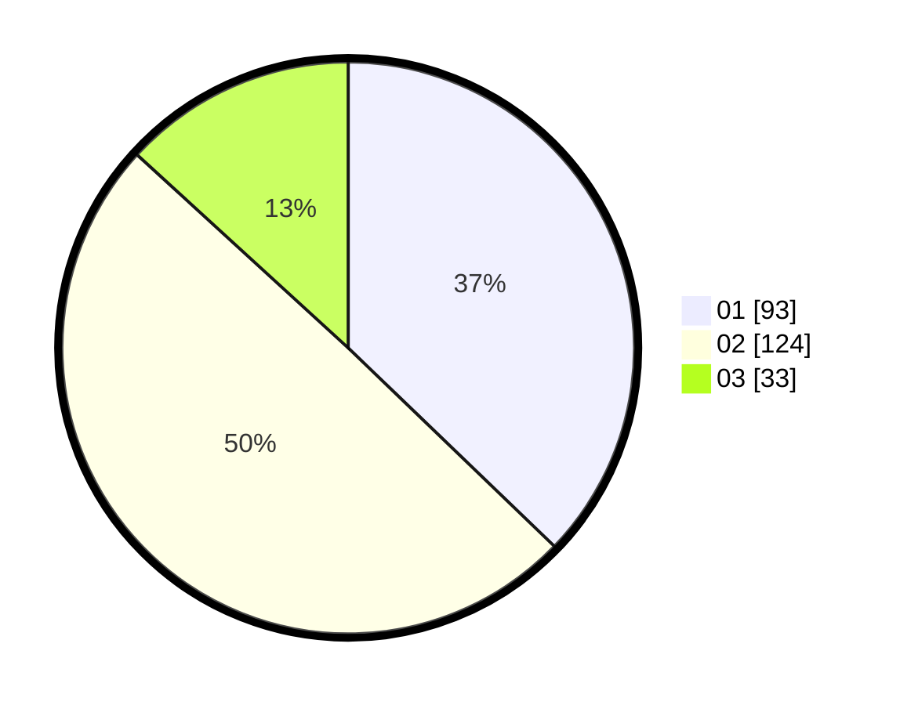

# Hasil

Hasil perolehan suara paslon dapat dilihat pada file paslon-01.txt, paslon-02.txt, dan paslon-03.txt.

Jika tidak ada, artinya data tersebut belum ada pada SIREKAP.

## Perolehan Suara

 * Paslon 01: **93**.
 * Paslon 02: **124**.
 * Paslon 03: **33**.

## Foto C Plano

https://sirekap-obj-formc.kpu.go.id/9550/pemilu/ppwp/31/73/08/10/01/3173081001001-20240214-201816--c742dbad-6388-43d1-9440-3e703c62ab47.jpg

https://sirekap-obj-formc.kpu.go.id/9550/pemilu/ppwp/31/73/08/10/01/3173081001001-20240214-194802--e21326df-dff5-4823-bcd0-089fdde7833a.jpg

https://sirekap-obj-formc.kpu.go.id/9550/pemilu/ppwp/31/73/08/10/01/3173081001001-20240214-201006--63d28666-e8bc-4f88-80a7-8d6d212ce095.jpg
