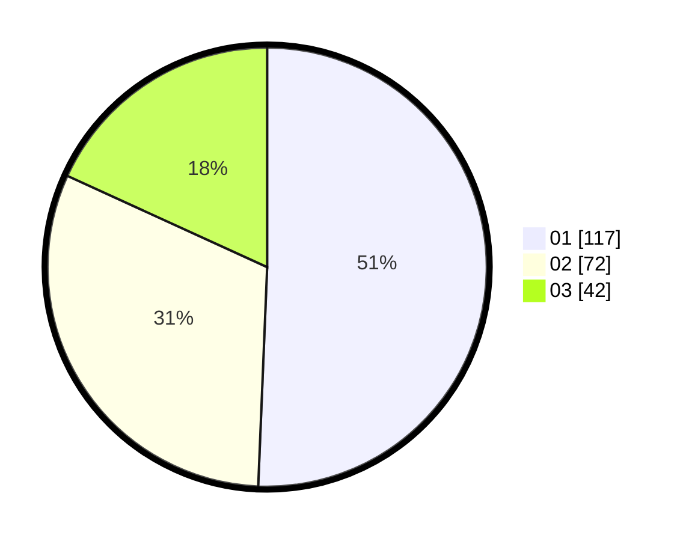

# Hasil

Hasil perolehan suara paslon dapat dilihat pada file paslon-01.txt, paslon-02.txt, dan paslon-03.txt.

Jika tidak ada, artinya data tersebut belum ada pada SIREKAP.

## Perolehan Suara

 * Paslon 01: **117**.
 * Paslon 02: **72**.
 * Paslon 03: **42**.

## Foto C Plano

https://sirekap-obj-formc.kpu.go.id/bb70/pemilu/ppwp/31/73/08/10/01/3173081001003-20240216-131905--d3841fe9-4691-4ff0-bf77-c40b652f6088.jpg

https://sirekap-obj-formc.kpu.go.id/bb70/pemilu/ppwp/31/73/08/10/01/3173081001003-20240216-131907--b28e110a-7977-42fc-b0d7-c8cc8dd31255.jpg

https://sirekap-obj-formc.kpu.go.id/bb70/pemilu/ppwp/31/73/08/10/01/3173081001003-20240216-131906--3dd40c4c-9ac7-4efc-ba94-ec64cf8a0a35.jpg

## DATA PEMILIH TETAP

Jumlah pemilih dalam DPT: **291**.
 * L: **147**.
 * P: **144**.

## DATA PENGGUNA HAK PILIH

Jumlah pengguna hak pilih dalam DPT: **225**.
 * L: **114**.
 * P: **111**.

Jumlah pengguna hak pilih dalam DPTb: **8**.
 * L: **2**.
 * P: **6**.

Jumlah pengguna hak pilih dalam DPK: **3**.
 * L: **2**.
 * P: **1**.

Jumlah pengguna hak pilih: **236**.
 * L: **118**.
 * P: **118**.

## JUMLAH SUARA SAH DAN TIDAK SAH

JUMLAH SELURUH SUARA SAH: **231**.

JUMLAH SUARA TIDAK SAH: **5**.

JUMLAH SELURUH SUARA SAH DAN SUARA TIDAK SAH: **236**.
