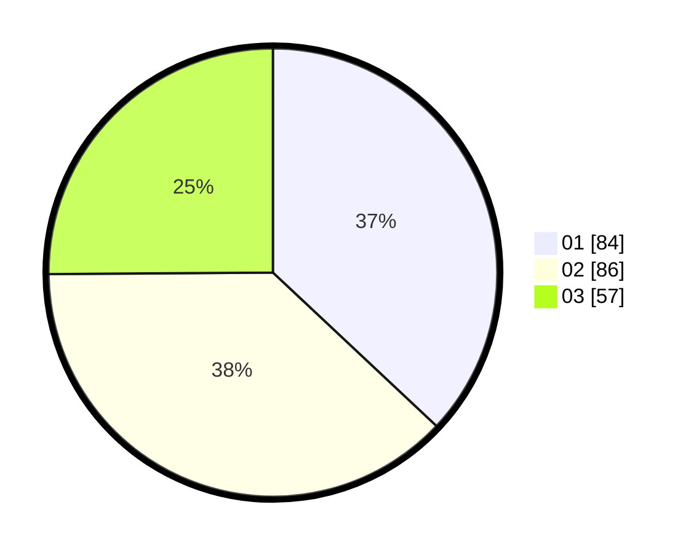

# Hasil

Hasil perolehan suara paslon dapat dilihat pada file paslon-01.txt, paslon-02.txt, dan paslon-03.txt.

Jika tidak ada, artinya data tersebut belum ada pada SIREKAP.

## Perolehan Suara

 * Paslon 01: **84**.
 * Paslon 02: **86**.
 * Paslon 03: **57**.

## Foto C Plano

https://sirekap-obj-formc.kpu.go.id/5fae/pemilu/ppwp/31/73/08/10/01/3173081001005-20240214-221605--d6468d49-a8f7-4225-8465-2a0bd4e06dac.jpg

https://sirekap-obj-formc.kpu.go.id/5fae/pemilu/ppwp/31/73/08/10/01/3173081001005-20240214-221731--81732826-ba4c-41f6-92ea-82c4472bb0bf.jpg

https://sirekap-obj-formc.kpu.go.id/5fae/pemilu/ppwp/31/73/08/10/01/3173081001005-20240214-222351--19ef231c-482f-49ee-987b-51834b2476e7.jpg
