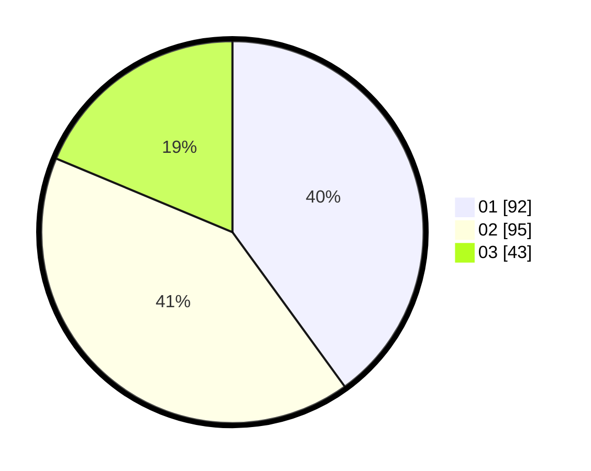

# Hasil

Hasil perolehan suara paslon dapat dilihat pada file paslon-01.txt, paslon-02.txt, dan paslon-03.txt.

Jika tidak ada, artinya data tersebut belum ada pada SIREKAP.

## Perolehan Suara

 * Paslon 01: **92**.
 * Paslon 02: **95**.
 * Paslon 03: **43**.

## Foto C Plano

https://sirekap-obj-formc.kpu.go.id/96a3/pemilu/ppwp/31/73/08/10/01/3173081001009-20240217-080839--7900ed95-cf49-4ec6-92d4-73f915ec75b3.jpg

https://sirekap-obj-formc.kpu.go.id/96a3/pemilu/ppwp/31/73/08/10/01/3173081001009-20240217-080841--3049db13-0c4c-44d3-af0a-0b86bb4ec232.jpg

https://sirekap-obj-formc.kpu.go.id/96a3/pemilu/ppwp/31/73/08/10/01/3173081001009-20240217-080840--712f1d58-4dd1-4bcd-8f75-b1beefc77116.jpg

## DATA PEMILIH TETAP

Jumlah pemilih dalam DPT: **214**.
 * L: **104**.
 * P: **110**.

## DATA PENGGUNA HAK PILIH

Jumlah pengguna hak pilih dalam DPT: **214**.
 * L: **104**.
 * P: **110**.

Jumlah pengguna hak pilih dalam DPTb: **12**.
 * L: **3**.
 * P: **9**.

Jumlah pengguna hak pilih dalam DPK: **7**.
 * L: **2**.
 * P: **5**.

Jumlah pengguna hak pilih: **233**.
 * L: **109**.
 * P: **124**.

## JUMLAH SUARA SAH DAN TIDAK SAH

JUMLAH SELURUH SUARA SAH: **230**.

JUMLAH SUARA TIDAK SAH: **3**.

JUMLAH SELURUH SUARA SAH DAN SUARA TIDAK SAH: **233**.
