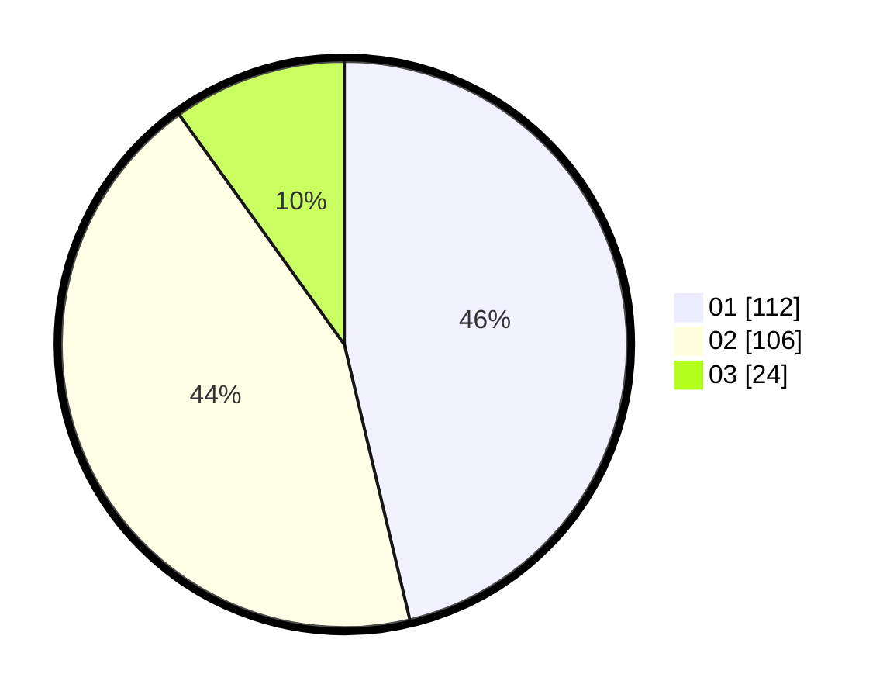

# Hasil

Hasil perolehan suara paslon dapat dilihat pada file paslon-01.txt, paslon-02.txt, dan paslon-03.txt.

Jika tidak ada, artinya data tersebut belum ada pada SIREKAP.

## Perolehan Suara

 * Paslon 01: **112**.
 * Paslon 02: **106**.
 * Paslon 03: **24**.

## Foto C Plano

https://sirekap-obj-formc.kpu.go.id/bb30/pemilu/ppwp/31/73/08/10/01/3173081001015-20240216-141419--02fa594a-9446-4b66-a4c5-7c490b38df58.jpg

https://sirekap-obj-formc.kpu.go.id/bb30/pemilu/ppwp/31/73/08/10/01/3173081001015-20240216-141420--7c00263a-023c-415f-a8bf-5d32db4e4f68.jpg

https://sirekap-obj-formc.kpu.go.id/bb30/pemilu/ppwp/31/73/08/10/01/3173081001015-20240216-141420--d07700e4-1a26-49fa-833a-0f4775d5ae5a.jpg

## DATA PEMILIH TETAP

Jumlah pemilih dalam DPT: **285**.
 * L: **134**.
 * P: **151**.

## DATA PENGGUNA HAK PILIH

Jumlah pengguna hak pilih dalam DPT: **241**.
 * L: **112**.
 * P: **129**.

Jumlah pengguna hak pilih dalam DPTb: **5**.
 * L: **3**.
 * P: **2**.

Jumlah pengguna hak pilih dalam DPK: **0**.
 * L: **0**.
 * P: **0**.

Jumlah pengguna hak pilih: **246**.
 * L: **115**.
 * P: **131**.

## JUMLAH SUARA SAH DAN TIDAK SAH

JUMLAH SELURUH SUARA SAH: **242**.

JUMLAH SUARA TIDAK SAH: **4**.

JUMLAH SELURUH SUARA SAH DAN SUARA TIDAK SAH: **246**.
