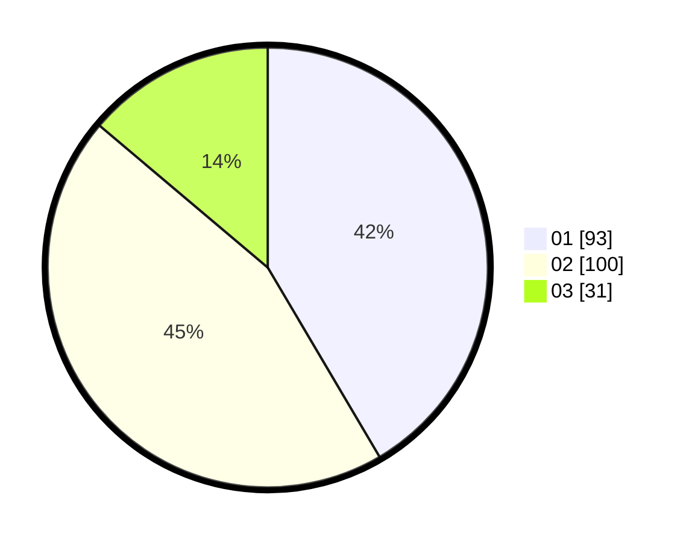

# Hasil

Hasil perolehan suara paslon dapat dilihat pada file paslon-01.txt, paslon-02.txt, dan paslon-03.txt.

Jika tidak ada, artinya data tersebut belum ada pada SIREKAP.

## Perolehan Suara

 * Paslon 01: **93**.
 * Paslon 02: **100**.
 * Paslon 03: **31**.

## Foto C Plano

https://sirekap-obj-formc.kpu.go.id/d6c4/pemilu/ppwp/31/73/08/10/01/3173081001017-20240216-033235--50db197c-5af5-49d4-8e33-56b219c82e61.jpg

https://sirekap-obj-formc.kpu.go.id/d6c4/pemilu/ppwp/31/73/08/10/01/3173081001017-20240216-033237--cd86c6ab-69a6-434e-9ba8-310f99fafe77.jpg

https://sirekap-obj-formc.kpu.go.id/d6c4/pemilu/ppwp/31/73/08/10/01/3173081001017-20240216-033236--ea87b29b-f283-4383-9620-16634e43daa7.jpg

## DATA PEMILIH TETAP

Jumlah pemilih dalam DPT: **279**.
 * L: **145**.
 * P: **134**.

## DATA PENGGUNA HAK PILIH

Jumlah pengguna hak pilih dalam DPT: **228**.
 * L: **119**.
 * P: **109**.

Jumlah pengguna hak pilih dalam DPTb: **2**.
 * L: **1**.
 * P: **1**.

Jumlah pengguna hak pilih dalam DPK: **0**.
 * L: **0**.
 * P: **0**.

Jumlah pengguna hak pilih: **230**.
 * L: **120**.
 * P: **110**.

## JUMLAH SUARA SAH DAN TIDAK SAH

JUMLAH SELURUH SUARA SAH: **224**.

JUMLAH SUARA TIDAK SAH: **6**.

JUMLAH SELURUH SUARA SAH DAN SUARA TIDAK SAH: **230**.
