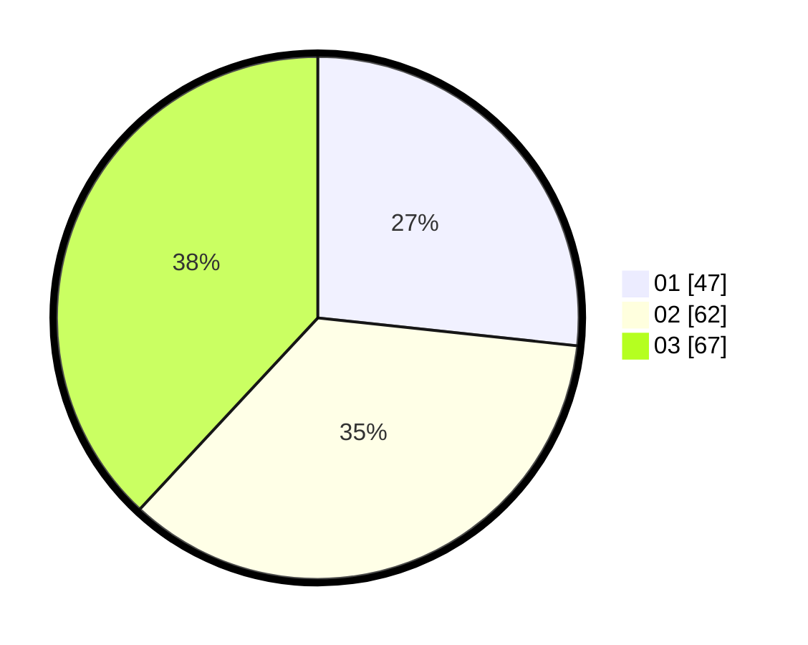

# Hasil

Hasil perolehan suara paslon dapat dilihat pada file paslon-01.txt, paslon-02.txt, dan paslon-03.txt.

Jika tidak ada, artinya data tersebut belum ada pada SIREKAP.

## Perolehan Suara

 * Paslon 01: **47**.
 * Paslon 02: **62**.
 * Paslon 03: **67**.

## Foto C Plano

https://sirekap-obj-formc.kpu.go.id/aa2b/pemilu/ppwp/31/73/08/10/01/3173081001020-20240214-155437--35ad8ab2-9725-484e-bd58-1bf7645aa857.jpg

https://sirekap-obj-formc.kpu.go.id/aa2b/pemilu/ppwp/31/73/08/10/01/3173081001020-20240214-184717--75ce5954-e624-4e2a-a5f3-1c8863f86c6f.jpg

https://sirekap-obj-formc.kpu.go.id/aa2b/pemilu/ppwp/31/73/08/10/01/3173081001020-20240214-155742--e4cf859e-2e5d-40f5-b3a5-4a4bd36ff378.jpg

## DATA PEMILIH TETAP

Jumlah pemilih dalam DPT: **276**.
 * L: **128**.
 * P: **148**.

## DATA PENGGUNA HAK PILIH

Jumlah pengguna hak pilih dalam DPT: **206**.
 * L: **91**.
 * P: **115**.

Jumlah pengguna hak pilih dalam DPTb: **10**.
 * L: **0**.
 * P: **10**.

Jumlah pengguna hak pilih dalam DPK: **3**.
 * L: **2**.
 * P: **1**.

Jumlah pengguna hak pilih: **219**.
 * L: **93**.
 * P: **126**.

## JUMLAH SUARA SAH DAN TIDAK SAH

JUMLAH SELURUH SUARA SAH: **218**.

JUMLAH SUARA TIDAK SAH: **1**.

JUMLAH SELURUH SUARA SAH DAN SUARA TIDAK SAH: **219**.
