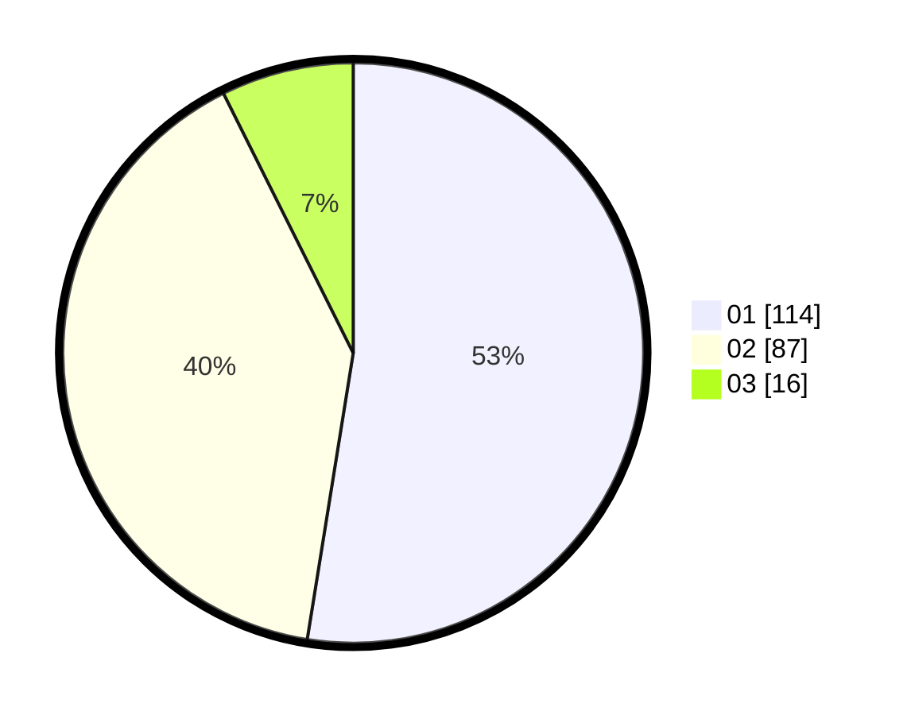

# Hasil

Hasil perolehan suara paslon dapat dilihat pada file paslon-01.txt, paslon-02.txt, dan paslon-03.txt.

Jika tidak ada, artinya data tersebut belum ada pada SIREKAP.

## Perolehan Suara

 * Paslon 01: **114**.
 * Paslon 02: **87**.
 * Paslon 03: **16**.

## Foto C Plano

https://sirekap-obj-formc.kpu.go.id/c03b/pemilu/ppwp/31/73/08/10/01/3173081001022-20240214-214040--a962192b-cf00-4156-b471-28c88285ae93.jpg

https://sirekap-obj-formc.kpu.go.id/c03b/pemilu/ppwp/31/73/08/10/01/3173081001022-20240214-214116--89e1cd8d-0854-4a69-b80d-54e42d5dc9f9.jpg

https://sirekap-obj-formc.kpu.go.id/c03b/pemilu/ppwp/31/73/08/10/01/3173081001022-20240214-214147--32eca401-255f-4dd2-80ca-9980b9225c64.jpg
