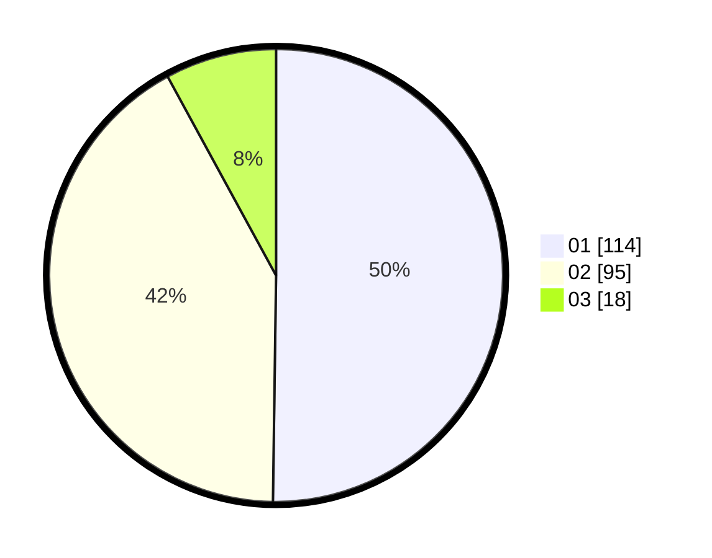

# Hasil

Hasil perolehan suara paslon dapat dilihat pada file paslon-01.txt, paslon-02.txt, dan paslon-03.txt.

Jika tidak ada, artinya data tersebut belum ada pada SIREKAP.

## Perolehan Suara

 * Paslon 01: **114**.
 * Paslon 02: **95**.
 * Paslon 03: **18**.

## Foto C Plano

https://sirekap-obj-formc.kpu.go.id/5bf6/pemilu/ppwp/31/73/08/10/01/3173081001025-20240214-190711--7e82e352-495c-41f0-abee-c6b39f7c98d0.jpg

https://sirekap-obj-formc.kpu.go.id/5bf6/pemilu/ppwp/31/73/08/10/01/3173081001025-20240214-190158--7269ee1b-0d1f-4e6b-93e3-259c066fcdde.jpg

https://sirekap-obj-formc.kpu.go.id/5bf6/pemilu/ppwp/31/73/08/10/01/3173081001025-20240214-191128--ccc85ea6-98a1-4853-a832-c4cf25b34c8b.jpg

## DATA PEMILIH TETAP

Jumlah pemilih dalam DPT: **230**.
 * L: **109**.
 * P: **121**.

## DATA PENGGUNA HAK PILIH

Jumlah pengguna hak pilih dalam DPT: **230**.
 * L: **109**.
 * P: **121**.

Jumlah pengguna hak pilih dalam DPTb: **0**.
 * L: **0**.
 * P: **0**.

Jumlah pengguna hak pilih dalam DPK: **4**.
 * L: **2**.
 * P: **2**.

Jumlah pengguna hak pilih: **234**.
 * L: **111**.
 * P: **123**.

## JUMLAH SUARA SAH DAN TIDAK SAH

JUMLAH SELURUH SUARA SAH: **227**.

JUMLAH SUARA TIDAK SAH: **7**.

JUMLAH SELURUH SUARA SAH DAN SUARA TIDAK SAH: **234**.
