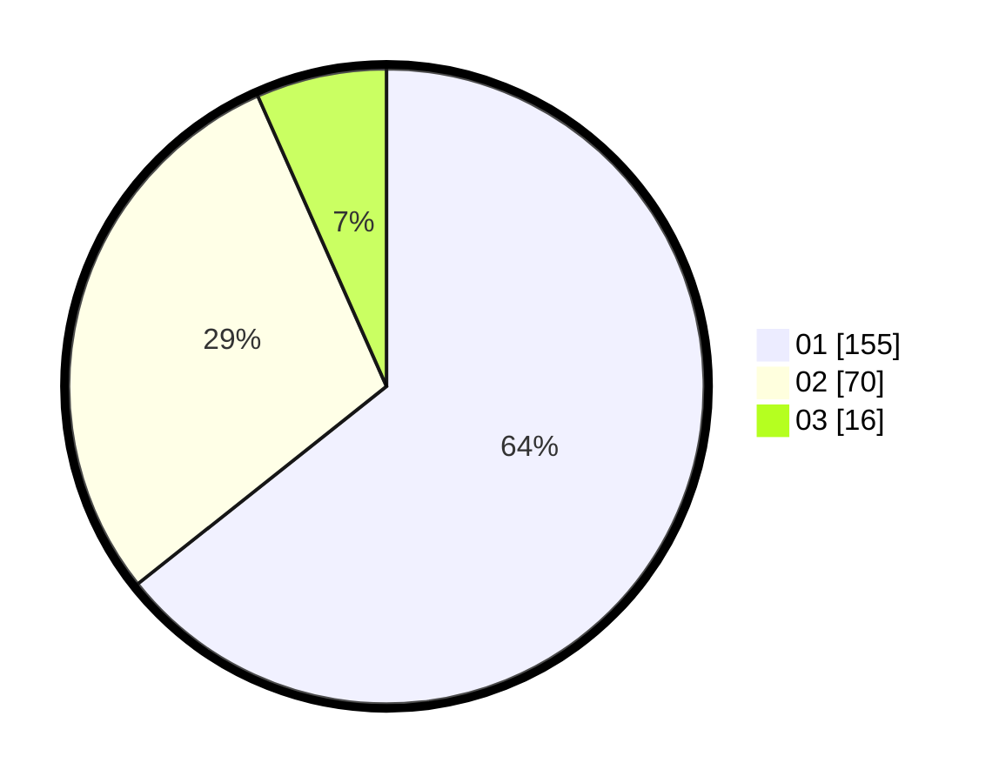

# Hasil

Hasil perolehan suara paslon dapat dilihat pada file paslon-01.txt, paslon-02.txt, dan paslon-03.txt.

Jika tidak ada, artinya data tersebut belum ada pada SIREKAP.

## Perolehan Suara

 * Paslon 01: **155**.
 * Paslon 02: **70**.
 * Paslon 03: **16**.

## Foto C Plano

https://sirekap-obj-formc.kpu.go.id/1408/pemilu/ppwp/31/73/08/10/01/3173081001026-20240215-210330--ff3337c1-1749-4b52-9d6f-22d98d892a0d.jpg

https://sirekap-obj-formc.kpu.go.id/1408/pemilu/ppwp/31/73/08/10/01/3173081001026-20240215-210331--10ad618e-537d-4c8f-b2fd-6bcceb4b5649.jpg

https://sirekap-obj-formc.kpu.go.id/1408/pemilu/ppwp/31/73/08/10/01/3173081001026-20240215-210331--81005393-7436-485c-8792-c1ced856c317.jpg

## DATA PEMILIH TETAP

Jumlah pemilih dalam DPT: **281**.
 * L: **145**.
 * P: **136**.

## DATA PENGGUNA HAK PILIH

Jumlah pengguna hak pilih dalam DPT: **244**.
 * L: **126**.
 * P: **118**.

Jumlah pengguna hak pilih dalam DPTb: **0**.
 * L: **0**.
 * P: **0**.

Jumlah pengguna hak pilih dalam DPK: **0**.
 * L: **0**.
 * P: **0**.

Jumlah pengguna hak pilih: **244**.
 * L: **126**.
 * P: **118**.

## JUMLAH SUARA SAH DAN TIDAK SAH

JUMLAH SELURUH SUARA SAH: **241**.

JUMLAH SUARA TIDAK SAH: **3**.

JUMLAH SELURUH SUARA SAH DAN SUARA TIDAK SAH: **244**.
