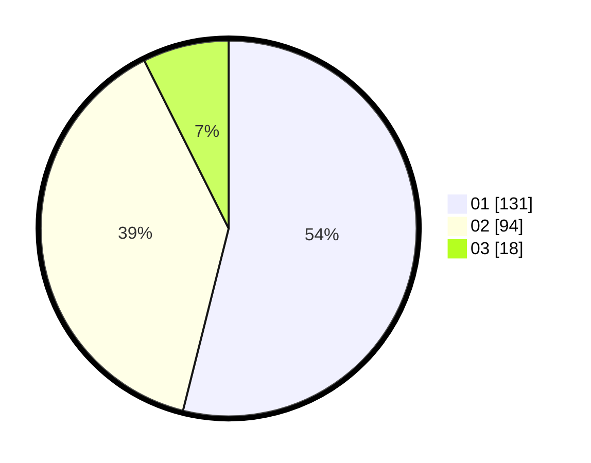

# Hasil

Hasil perolehan suara paslon dapat dilihat pada file paslon-01.txt, paslon-02.txt, dan paslon-03.txt.

Jika tidak ada, artinya data tersebut belum ada pada SIREKAP.

## Perolehan Suara

 * Paslon 01: **131**.
 * Paslon 02: **94**.
 * Paslon 03: **18**.

## Foto C Plano

https://sirekap-obj-formc.kpu.go.id/479a/pemilu/ppwp/31/73/08/10/01/3173081001027-20240216-153947--65d1932b-80cb-42fa-a49a-dd6fd6acb55a.jpg

https://sirekap-obj-formc.kpu.go.id/479a/pemilu/ppwp/31/73/08/10/01/3173081001027-20240216-153948--828e3795-40d4-4a73-91ff-59ccfd06d684.jpg

https://sirekap-obj-formc.kpu.go.id/479a/pemilu/ppwp/31/73/08/10/01/3173081001027-20240216-153947--7b972a20-1c3e-4a2a-ac0f-9d8bbbfbf7ff.jpg

## DATA PEMILIH TETAP

Jumlah pemilih dalam DPT: **281**.
 * L: **138**.
 * P: **143**.

## DATA PENGGUNA HAK PILIH

Jumlah pengguna hak pilih dalam DPT: **281**.
 * L: **138**.
 * P: **143**.

Jumlah pengguna hak pilih dalam DPTb: **0**.
 * L: **0**.
 * P: **0**.

Jumlah pengguna hak pilih dalam DPK: **0**.
 * L: **0**.
 * P: **0**.

Jumlah pengguna hak pilih: **281**.
 * L: **138**.
 * P: **143**.

## JUMLAH SUARA SAH DAN TIDAK SAH

JUMLAH SELURUH SUARA SAH: **243**.

JUMLAH SUARA TIDAK SAH: **1**.

JUMLAH SELURUH SUARA SAH DAN SUARA TIDAK SAH: **244**.
