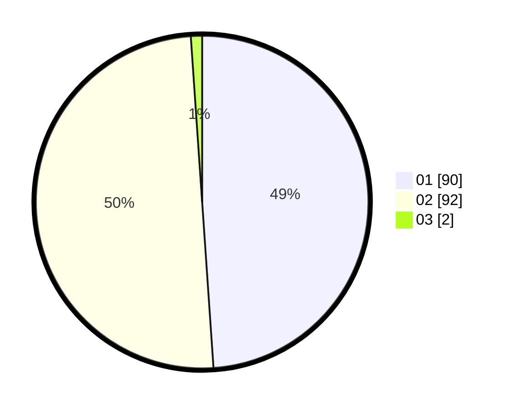

# Hasil

Hasil perolehan suara paslon dapat dilihat pada file paslon-01.txt, paslon-02.txt, dan paslon-03.txt.

Jika tidak ada, artinya data tersebut belum ada pada SIREKAP.

## Perolehan Suara

 * Paslon 01: **90**.
 * Paslon 02: **92**.
 * Paslon 03: **2**.

## Foto C Plano

https://sirekap-obj-formc.kpu.go.id/714f/pemilu/ppwp/31/73/08/10/01/3173081001034-20240215-215516--87d3c596-1bd9-43bd-bca3-c55811e5acfd.jpg

https://sirekap-obj-formc.kpu.go.id/714f/pemilu/ppwp/31/73/08/10/01/3173081001034-20240215-215518--b9f62f62-f321-4fec-9836-ead39b3d8cb6.jpg

https://sirekap-obj-formc.kpu.go.id/714f/pemilu/ppwp/31/73/08/10/01/3173081001034-20240215-215517--ce9542a0-855c-453a-88c0-622f76254235.jpg

## DATA PEMILIH TETAP

Jumlah pemilih dalam DPT: **276**.
 * L: **146**.
 * P: **130**.

## DATA PENGGUNA HAK PILIH

Jumlah pengguna hak pilih dalam DPT: **200**.
 * L: **103**.
 * P: **97**.

Jumlah pengguna hak pilih dalam DPTb: **4**.
 * L: **1**.
 * P: **3**.

Jumlah pengguna hak pilih dalam DPK: **0**.
 * L: **0**.
 * P: **0**.

Jumlah pengguna hak pilih: **204**.
 * L: **104**.
 * P: **100**.

## JUMLAH SUARA SAH DAN TIDAK SAH

JUMLAH SELURUH SUARA SAH: **202**.

JUMLAH SUARA TIDAK SAH: **2**.

JUMLAH SELURUH SUARA SAH DAN SUARA TIDAK SAH: **204**.
