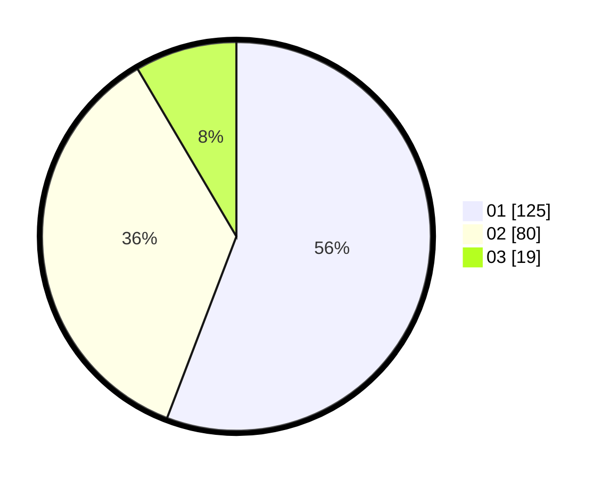

# Hasil

Hasil perolehan suara paslon dapat dilihat pada file paslon-01.txt, paslon-02.txt, dan paslon-03.txt.

Jika tidak ada, artinya data tersebut belum ada pada SIREKAP.

## Perolehan Suara

 * Paslon 01: **125**.
 * Paslon 02: **80**.
 * Paslon 03: **19**.

## Foto C Plano

https://sirekap-obj-formc.kpu.go.id/885b/pemilu/ppwp/31/73/08/10/01/3173081001035-20240214-185904--6be764ef-990d-4716-965c-71d5581f28e2.jpg

https://sirekap-obj-formc.kpu.go.id/885b/pemilu/ppwp/31/73/08/10/01/3173081001035-20240214-195220--954fd958-bcbb-4514-8f20-75171c366575.jpg

https://sirekap-obj-formc.kpu.go.id/885b/pemilu/ppwp/31/73/08/10/01/3173081001035-20240214-192228--d6c446db-05fe-41bc-b5ea-5e875b2950a0.jpg

## DATA PEMILIH TETAP

Jumlah pemilih dalam DPT: **273**.
 * L: **142**.
 * P: **131**.

## DATA PENGGUNA HAK PILIH

Jumlah pengguna hak pilih dalam DPT: **228**.
 * L: **118**.
 * P: **110**.

Jumlah pengguna hak pilih dalam DPTb: **2**.
 * L: **0**.
 * P: **2**.

Jumlah pengguna hak pilih dalam DPK: **2**.
 * L: **0**.
 * P: **2**.

Jumlah pengguna hak pilih: **222**.
 * L: **119**.
 * P: **113**.

## JUMLAH SUARA SAH DAN TIDAK SAH

JUMLAH SELURUH SUARA SAH: **224**.

JUMLAH SUARA TIDAK SAH: **8**.

JUMLAH SELURUH SUARA SAH DAN SUARA TIDAK SAH: **232**.
