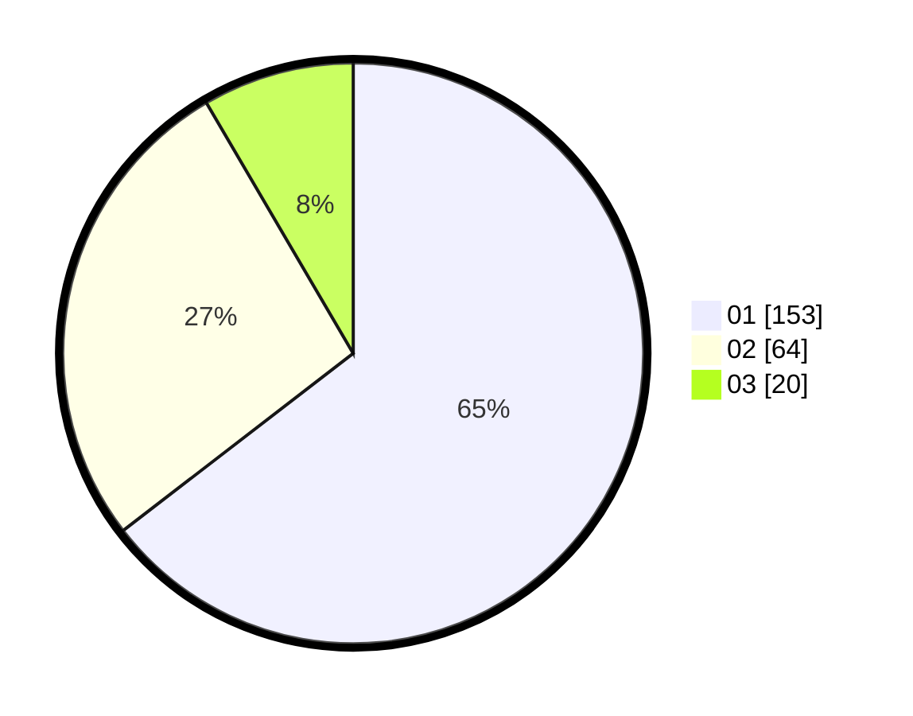

# Hasil

Hasil perolehan suara paslon dapat dilihat pada file paslon-01.txt, paslon-02.txt, dan paslon-03.txt.

Jika tidak ada, artinya data tersebut belum ada pada SIREKAP.

## Perolehan Suara

 * Paslon 01: **153**.
 * Paslon 02: **64**.
 * Paslon 03: **20**.

## Foto C Plano

https://sirekap-obj-formc.kpu.go.id/eaa3/pemilu/ppwp/31/73/08/10/01/3173081001036-20240216-073150--8b4cce54-5d8b-4513-bf85-ae225a204ec8.jpg

https://sirekap-obj-formc.kpu.go.id/eaa3/pemilu/ppwp/31/73/08/10/01/3173081001036-20240216-073152--8dfb769a-c3c4-4c46-b6b5-887f4db25c4f.jpg

https://sirekap-obj-formc.kpu.go.id/eaa3/pemilu/ppwp/31/73/08/10/01/3173081001036-20240216-073151--475d40f2-c60c-426e-b28c-70c1eae6c1a4.jpg

## DATA PEMILIH TETAP

Jumlah pemilih dalam DPT: **273**.
 * L: **144**.
 * P: **129**.

## DATA PENGGUNA HAK PILIH

Jumlah pengguna hak pilih dalam DPT: **234**.
 * L: **125**.
 * P: **109**.

Jumlah pengguna hak pilih dalam DPTb: **4**.
 * L: **1**.
 * P: **3**.

Jumlah pengguna hak pilih dalam DPK: **1**.
 * L: **0**.
 * P: **1**.

Jumlah pengguna hak pilih: **239**.
 * L: **126**.
 * P: **113**.

## JUMLAH SUARA SAH DAN TIDAK SAH

JUMLAH SELURUH SUARA SAH: **237**.

JUMLAH SUARA TIDAK SAH: **2**.

JUMLAH SELURUH SUARA SAH DAN SUARA TIDAK SAH: **239**.
