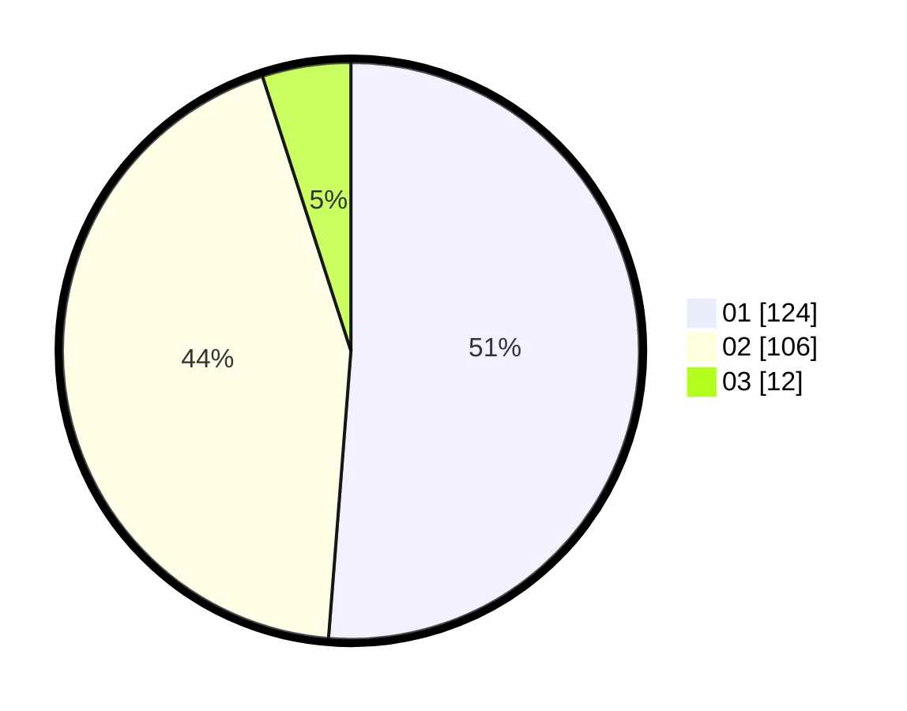

# Hasil

Hasil perolehan suara paslon dapat dilihat pada file paslon-01.txt, paslon-02.txt, dan paslon-03.txt.

Jika tidak ada, artinya data tersebut belum ada pada SIREKAP.

## Perolehan Suara

 * Paslon 01: **124**.
 * Paslon 02: **106**.
 * Paslon 03: **12**.

## Foto C Plano

https://sirekap-obj-formc.kpu.go.id/bf5f/pemilu/ppwp/31/73/08/10/01/3173081001041-20240214-191743--9f7e15eb-8073-4ad3-9d8a-b3f3fb1f2fe8.jpg

https://sirekap-obj-formc.kpu.go.id/bf5f/pemilu/ppwp/31/73/08/10/01/3173081001041-20240214-191747--420358d6-3ad7-439c-ba23-3a2c43a8f180.jpg

https://sirekap-obj-formc.kpu.go.id/bf5f/pemilu/ppwp/31/73/08/10/01/3173081001041-20240214-211646--658968e2-8018-469e-8264-49a2ea6688bb.jpg

## DATA PEMILIH TETAP

Jumlah pemilih dalam DPT: **288**.
 * L: **144**.
 * P: **144**.

## DATA PENGGUNA HAK PILIH

Jumlah pengguna hak pilih dalam DPT: **247**.
 * L: **122**.
 * P: **125**.

Jumlah pengguna hak pilih dalam DPTb: **0**.
 * L: **0**.
 * P: **0**.

Jumlah pengguna hak pilih dalam DPK: **0**.
 * L: **0**.
 * P: **0**.

Jumlah pengguna hak pilih: **247**.
 * L: **122**.
 * P: **125**.

## JUMLAH SUARA SAH DAN TIDAK SAH

JUMLAH SELURUH SUARA SAH: **242**.

JUMLAH SUARA TIDAK SAH: **5**.

JUMLAH SELURUH SUARA SAH DAN SUARA TIDAK SAH: **247**.
