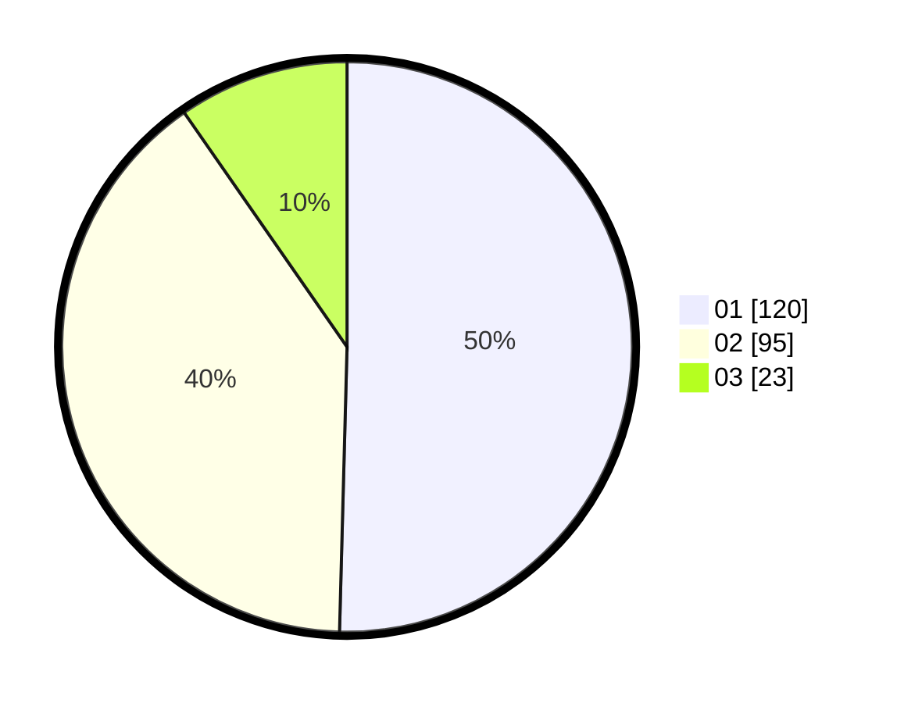

# Hasil

Hasil perolehan suara paslon dapat dilihat pada file paslon-01.txt, paslon-02.txt, dan paslon-03.txt.

Jika tidak ada, artinya data tersebut belum ada pada SIREKAP.

## Perolehan Suara

 * Paslon 01: **120**.
 * Paslon 02: **95**.
 * Paslon 03: **23**.

## Foto C Plano

https://sirekap-obj-formc.kpu.go.id/cb80/pemilu/ppwp/31/73/08/10/01/3173081001047-20240214-225536--91f434c9-c9e0-4fde-8d7d-f2c2a422ced7.jpg

https://sirekap-obj-formc.kpu.go.id/cb80/pemilu/ppwp/31/73/08/10/01/3173081001047-20240214-220107--9a1e6f29-ba67-4585-ae87-6965dd0afc3e.jpg

https://sirekap-obj-formc.kpu.go.id/cb80/pemilu/ppwp/31/73/08/10/01/3173081001047-20240214-220600--40b1bb55-09ff-4d19-bd83-460288f3f0f9.jpg
