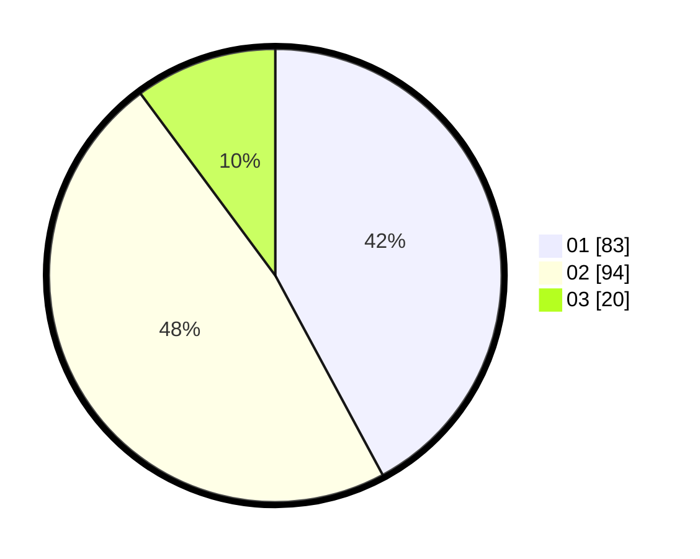

# Hasil

Hasil perolehan suara paslon dapat dilihat pada file paslon-01.txt, paslon-02.txt, dan paslon-03.txt.

Jika tidak ada, artinya data tersebut belum ada pada SIREKAP.

## Perolehan Suara

 * Paslon 01: **83**.
 * Paslon 02: **94**.
 * Paslon 03: **20**.

## Foto C Plano

https://sirekap-obj-formc.kpu.go.id/bc43/pemilu/ppwp/31/73/08/10/01/3173081001049-20240214-235905--314c93b6-08eb-437f-b2dd-3956913b0e40.jpg

https://sirekap-obj-formc.kpu.go.id/bc43/pemilu/ppwp/31/73/08/10/01/3173081001049-20240214-234707--f0fe9e86-d14c-4b68-b819-482faab74729.jpg

https://sirekap-obj-formc.kpu.go.id/bc43/pemilu/ppwp/31/73/08/10/01/3173081001049-20240215-001003--ad20abe0-4849-4833-b51c-6fb58125464e.jpg
