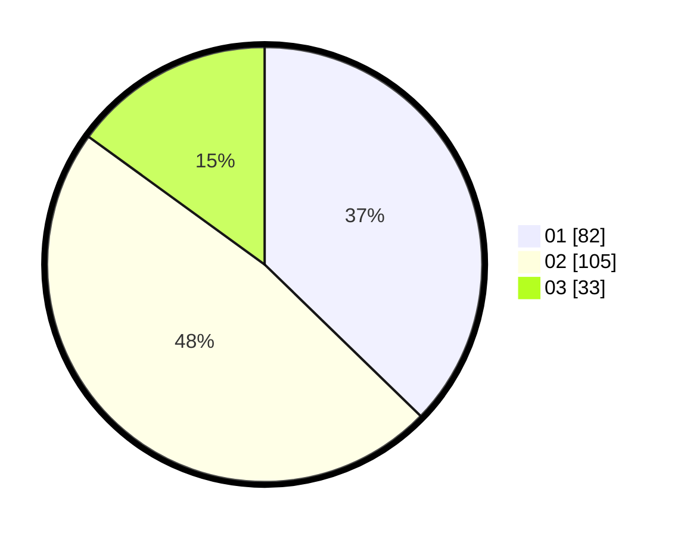

# Hasil

Hasil perolehan suara paslon dapat dilihat pada file paslon-01.txt, paslon-02.txt, dan paslon-03.txt.

Jika tidak ada, artinya data tersebut belum ada pada SIREKAP.

## Perolehan Suara

 * Paslon 01: **82**.
 * Paslon 02: **105**.
 * Paslon 03: **33**.

## Foto C Plano

https://sirekap-obj-formc.kpu.go.id/c707/pemilu/ppwp/31/73/08/10/01/3173081001061-20240214-211449--848fcfa7-c943-499b-a235-5190011cde5f.jpg

https://sirekap-obj-formc.kpu.go.id/c707/pemilu/ppwp/31/73/08/10/01/3173081001061-20240214-211637--8bb009de-ff3a-41cf-aef0-7a9cfa62c1c6.jpg

https://sirekap-obj-formc.kpu.go.id/c707/pemilu/ppwp/31/73/08/10/01/3173081001061-20240214-211810--6ee88ddd-b228-47cf-bb45-41a97629540f.jpg
