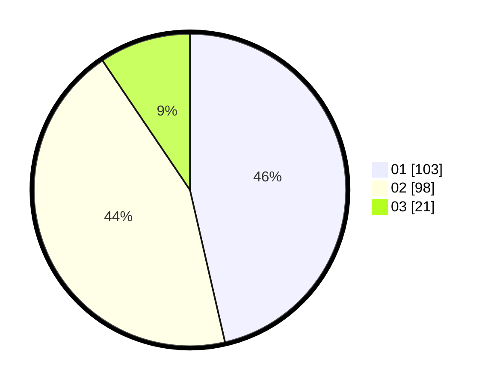

# Hasil

Hasil perolehan suara paslon dapat dilihat pada file paslon-01.txt, paslon-02.txt, dan paslon-03.txt.

Jika tidak ada, artinya data tersebut belum ada pada SIREKAP.

## Perolehan Suara

 * Paslon 01: **103**.
 * Paslon 02: **98**.
 * Paslon 03: **21**.

## Foto C Plano

https://sirekap-obj-formc.kpu.go.id/ed52/pemilu/ppwp/31/73/08/10/01/3173081001062-20240214-193104--62d3a51e-37e4-4470-944b-567e6b309b69.jpg

https://sirekap-obj-formc.kpu.go.id/ed52/pemilu/ppwp/31/73/08/10/01/3173081001062-20240214-191702--7e9e7289-761e-4395-911f-5a41fb7b5b0a.jpg

https://sirekap-obj-formc.kpu.go.id/ed52/pemilu/ppwp/31/73/08/10/01/3173081001062-20240214-193255--62691dd5-72c3-4a66-bfaf-ef4634f23f09.jpg
