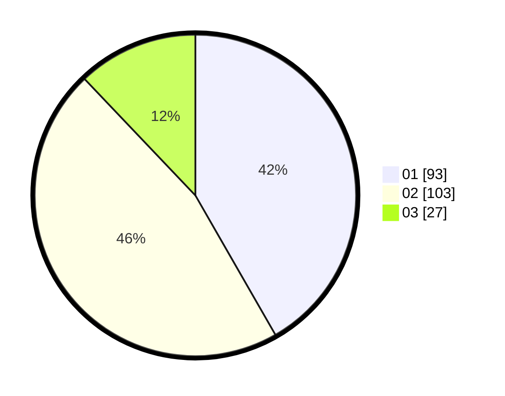

# Hasil

Hasil perolehan suara paslon dapat dilihat pada file paslon-01.txt, paslon-02.txt, dan paslon-03.txt.

Jika tidak ada, artinya data tersebut belum ada pada SIREKAP.

## Perolehan Suara

 * Paslon 01: **93**.
 * Paslon 02: **103**.
 * Paslon 03: **27**.

## Foto C Plano

https://sirekap-obj-formc.kpu.go.id/b932/pemilu/ppwp/31/73/08/10/01/3173081001072-20240214-214620--b09c79e3-ee08-4233-ab49-466d9095365f.jpg

https://sirekap-obj-formc.kpu.go.id/b932/pemilu/ppwp/31/73/08/10/01/3173081001072-20240214-214817--fb0d8603-e87a-478c-b6bc-a952af4c4218.jpg

https://sirekap-obj-formc.kpu.go.id/b932/pemilu/ppwp/31/73/08/10/01/3173081001072-20240214-214931--4eba418e-8e4c-4afb-b247-3eee81bfa8ba.jpg
