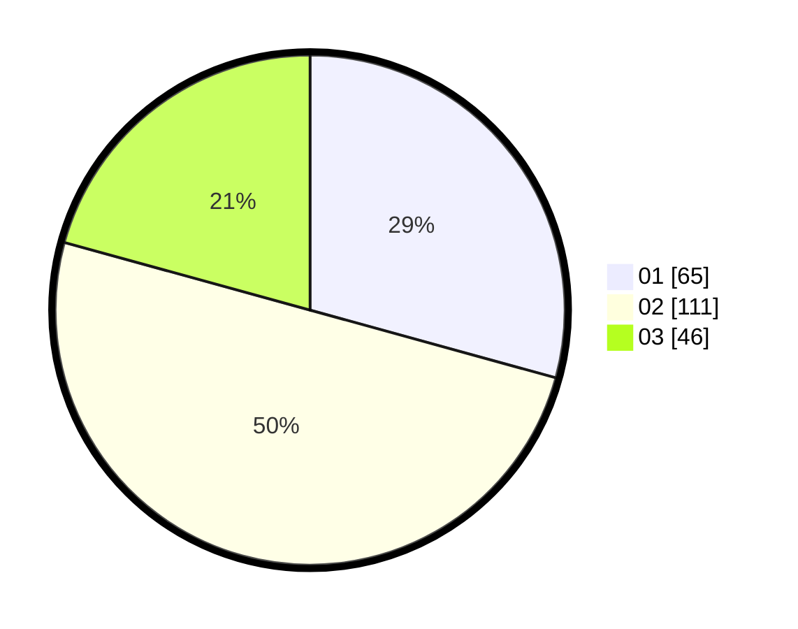

# Hasil

Hasil perolehan suara paslon dapat dilihat pada file paslon-01.txt, paslon-02.txt, dan paslon-03.txt.

Jika tidak ada, artinya data tersebut belum ada pada SIREKAP.

## Perolehan Suara

 * Paslon 01: **65**.
 * Paslon 02: **111**.
 * Paslon 03: **46**.

## Foto C Plano

https://sirekap-obj-formc.kpu.go.id/f78b/pemilu/ppwp/31/73/08/10/01/3173081001075-20240219-094421--21ca9a9f-c8f5-4ff8-9a48-8ea198ccc9b0.jpg

https://sirekap-obj-formc.kpu.go.id/f78b/pemilu/ppwp/31/73/08/10/01/3173081001075-20240219-094423--31bfd14a-21e1-45fc-8063-de723efe5e02.jpg

https://sirekap-obj-formc.kpu.go.id/f78b/pemilu/ppwp/31/73/08/10/01/3173081001075-20240219-094422--622fb3de-2731-44e7-8d7a-80c3abbe8318.jpg

## DATA PEMILIH TETAP

Jumlah pemilih dalam DPT: **277**.
 * L: **149**.
 * P: **128**.

## DATA PENGGUNA HAK PILIH

Jumlah pengguna hak pilih dalam DPT: **223**.
 * L: **115**.
 * P: **108**.

Jumlah pengguna hak pilih dalam DPTb: **0**.
 * L: **0**.
 * P: **0**.

Jumlah pengguna hak pilih dalam DPK: **0**.
 * L: **0**.
 * P: **0**.

Jumlah pengguna hak pilih: **223**.
 * L: **115**.
 * P: **108**.

## JUMLAH SUARA SAH DAN TIDAK SAH

JUMLAH SELURUH SUARA SAH: **222**.

JUMLAH SUARA TIDAK SAH: **1**.

JUMLAH SELURUH SUARA SAH DAN SUARA TIDAK SAH: **223**.
