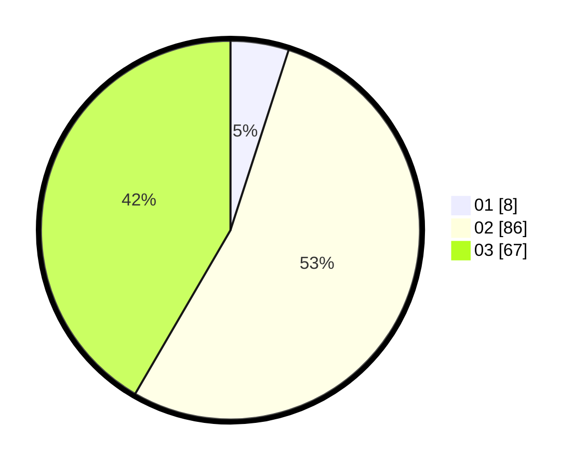

# Hasil

Hasil perolehan suara paslon dapat dilihat pada file paslon-01.txt, paslon-02.txt, dan paslon-03.txt.

Jika tidak ada, artinya data tersebut belum ada pada SIREKAP.

## Perolehan Suara

 * Paslon 01: **8**.
 * Paslon 02: **86**.
 * Paslon 03: **67**.

## Foto C Plano

https://sirekap-obj-formc.kpu.go.id/135c/pemilu/ppwp/31/73/08/10/01/3173081001080-20240214-204011--81d5a1f8-8f94-413a-b0fc-b7bf56ecdf3a.jpg

https://sirekap-obj-formc.kpu.go.id/135c/pemilu/ppwp/31/73/08/10/01/3173081001080-20240214-204053--6a4ea340-4995-42ad-b825-afd0a4176fd0.jpg

https://sirekap-obj-formc.kpu.go.id/135c/pemilu/ppwp/31/73/08/10/01/3173081001080-20240214-204133--e7c544b4-b326-4de6-b3a8-247bf3c2805c.jpg

## DATA PEMILIH TETAP

Jumlah pemilih dalam DPT: **229**.
 * L: **108**.
 * P: **121**.

## DATA PENGGUNA HAK PILIH

Jumlah pengguna hak pilih dalam DPT: **161**.
 * L: **77**.
 * P: **84**.

Jumlah pengguna hak pilih dalam DPTb: **0**.
 * L: **0**.
 * P: **0**.

Jumlah pengguna hak pilih dalam DPK: **3**.
 * L: **3**.
 * P: **0**.

Jumlah pengguna hak pilih: **164**.
 * L: **80**.
 * P: **84**.

## JUMLAH SUARA SAH DAN TIDAK SAH

JUMLAH SELURUH SUARA SAH: **161**.

JUMLAH SUARA TIDAK SAH: **3**.

JUMLAH SELURUH SUARA SAH DAN SUARA TIDAK SAH: **164**.
