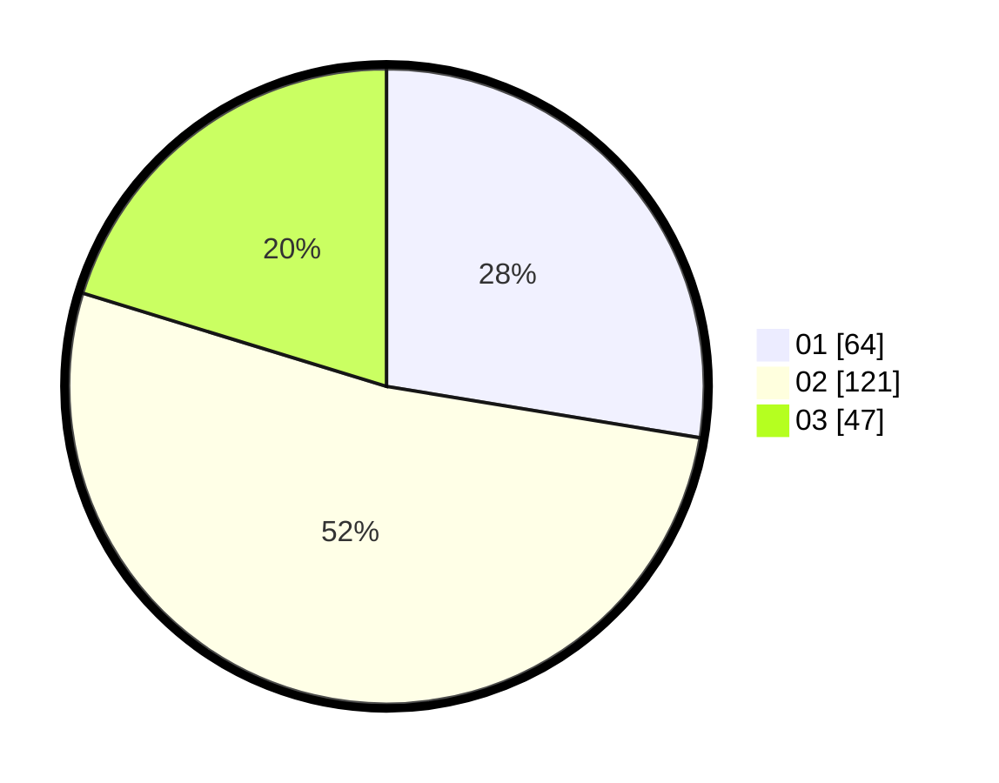

# Hasil

Hasil perolehan suara paslon dapat dilihat pada file paslon-01.txt, paslon-02.txt, dan paslon-03.txt.

Jika tidak ada, artinya data tersebut belum ada pada SIREKAP.

## Perolehan Suara

 * Paslon 01: **64**.
 * Paslon 02: **121**.
 * Paslon 03: **47**.

## Foto C Plano

https://sirekap-obj-formc.kpu.go.id/8159/pemilu/ppwp/31/73/08/10/01/3173081001088-20240214-204610--61a64213-0da3-467f-a4c8-6d4f4c07939c.jpg

https://sirekap-obj-formc.kpu.go.id/8159/pemilu/ppwp/31/73/08/10/01/3173081001088-20240214-204655--549f3d63-bde8-4d32-a272-bfbe338c901a.jpg

https://sirekap-obj-formc.kpu.go.id/8159/pemilu/ppwp/31/73/08/10/01/3173081001088-20240214-204825--c00951ac-d98e-46ab-b8de-946fa1e06c66.jpg

## DATA PEMILIH TETAP

Jumlah pemilih dalam DPT: **291**.
 * L: **155**.
 * P: **136**.

## DATA PENGGUNA HAK PILIH

Jumlah pengguna hak pilih dalam DPT: **228**.
 * L: **120**.
 * P: **108**.

Jumlah pengguna hak pilih dalam DPTb: **0**.
 * L: **0**.
 * P: **0**.

Jumlah pengguna hak pilih dalam DPK: **6**.
 * L: **3**.
 * P: **3**.

Jumlah pengguna hak pilih: **234**.
 * L: **123**.
 * P: **111**.

## JUMLAH SUARA SAH DAN TIDAK SAH

JUMLAH SELURUH SUARA SAH: **232**.

JUMLAH SUARA TIDAK SAH: **2**.

JUMLAH SELURUH SUARA SAH DAN SUARA TIDAK SAH: **234**.
