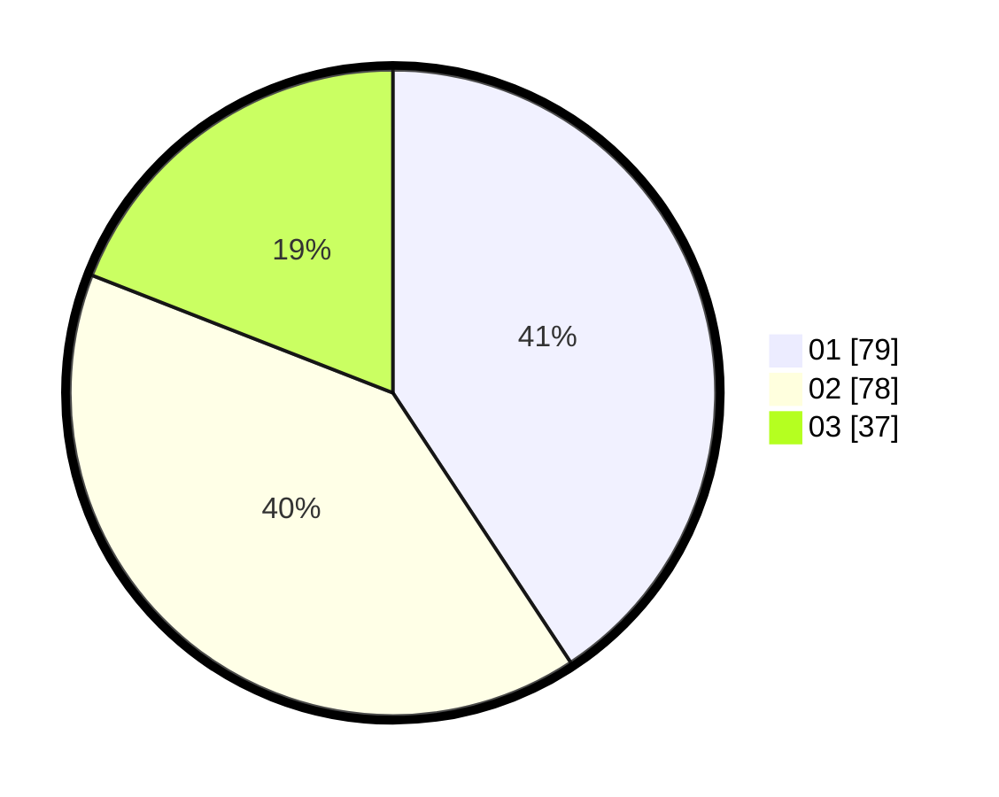

# Hasil

Hasil perolehan suara paslon dapat dilihat pada file paslon-01.txt, paslon-02.txt, dan paslon-03.txt.

Jika tidak ada, artinya data tersebut belum ada pada SIREKAP.

## Perolehan Suara

 * Paslon 01: **79**.
 * Paslon 02: **78**.
 * Paslon 03: **37**.

## Foto C Plano

https://sirekap-obj-formc.kpu.go.id/ae26/pemilu/ppwp/31/73/08/10/01/3173081001090-20240216-021911--e7c3aa07-7b59-4d11-afd6-a431b9d4b141.jpg

https://sirekap-obj-formc.kpu.go.id/ae26/pemilu/ppwp/31/73/08/10/01/3173081001090-20240216-021913--6a094ca9-b14a-4891-9295-009b1fdb557a.jpg

https://sirekap-obj-formc.kpu.go.id/ae26/pemilu/ppwp/31/73/08/10/01/3173081001090-20240216-021912--50a4a321-8bec-4ee2-b77b-baa8c54ea774.jpg

## DATA PEMILIH TETAP

Jumlah pemilih dalam DPT: **262**.
 * L: **124**.
 * P: **138**.

## DATA PENGGUNA HAK PILIH

Jumlah pengguna hak pilih dalam DPT: **192**.
 * L: **83**.
 * P: **109**.

Jumlah pengguna hak pilih dalam DPTb: **0**.
 * L: **0**.
 * P: **0**.

Jumlah pengguna hak pilih dalam DPK: **4**.
 * L: **3**.
 * P: **1**.

Jumlah pengguna hak pilih: **196**.
 * L: **86**.
 * P: **110**.

## JUMLAH SUARA SAH DAN TIDAK SAH

JUMLAH SELURUH SUARA SAH: **194**.

JUMLAH SUARA TIDAK SAH: **2**.

JUMLAH SELURUH SUARA SAH DAN SUARA TIDAK SAH: **196**.
