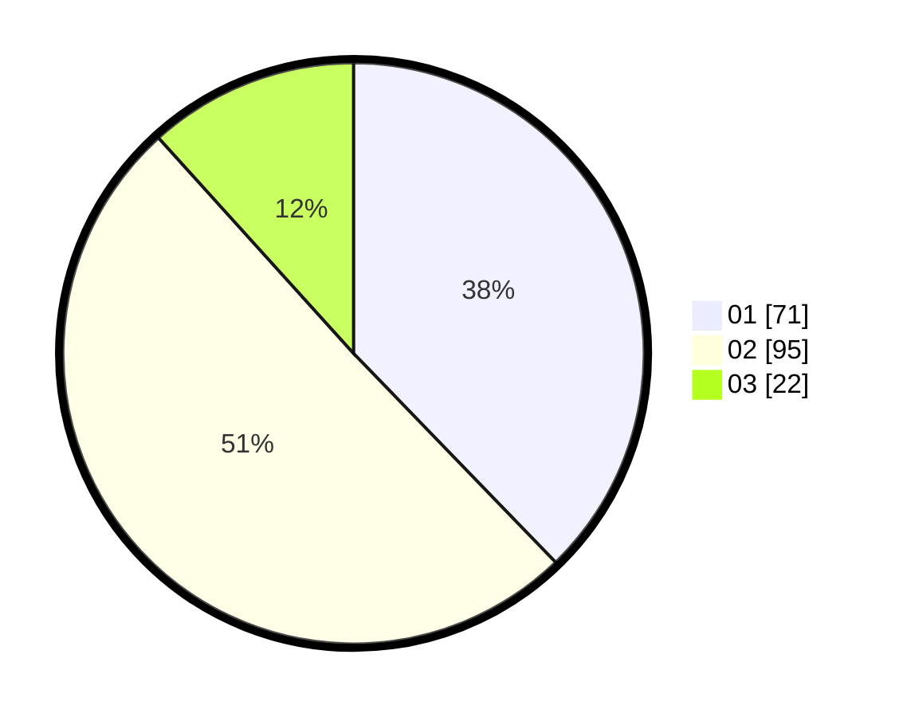

# Hasil

Hasil perolehan suara paslon dapat dilihat pada file paslon-01.txt, paslon-02.txt, dan paslon-03.txt.

Jika tidak ada, artinya data tersebut belum ada pada SIREKAP.

## Perolehan Suara

 * Paslon 01: **71**.
 * Paslon 02: **95**.
 * Paslon 03: **22**.

## Foto C Plano

https://sirekap-obj-formc.kpu.go.id/5d0a/pemilu/ppwp/31/73/08/10/01/3173081001095-20240214-233404--cfd6a432-4434-41c4-aa9c-1b19d819b6b6.jpg

https://sirekap-obj-formc.kpu.go.id/5d0a/pemilu/ppwp/31/73/08/10/01/3173081001095-20240214-233518--d4e02d8c-8028-4a09-9b27-4d6940c7cc7c.jpg

https://sirekap-obj-formc.kpu.go.id/5d0a/pemilu/ppwp/31/73/08/10/01/3173081001095-20240214-234014--91c7b7f7-38b1-4a18-86c0-78e12d7f4161.jpg
