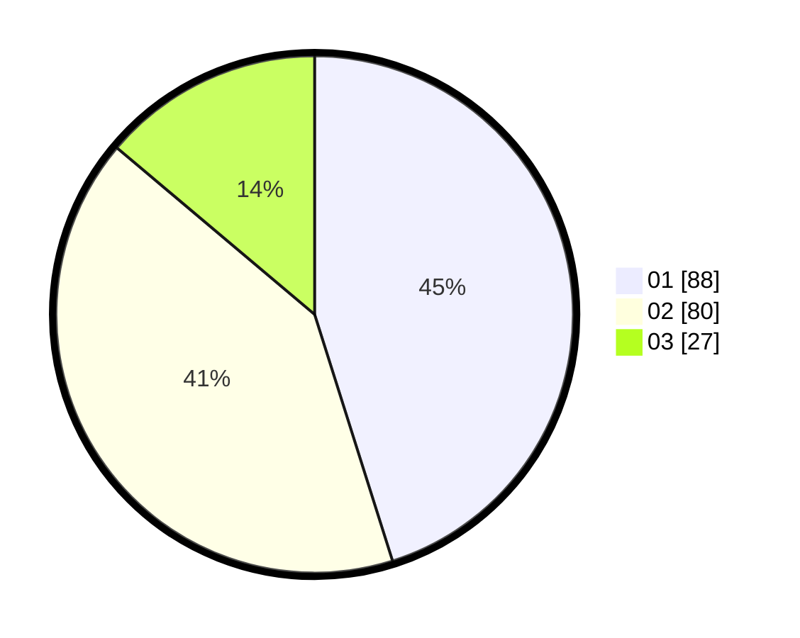

# Hasil

Hasil perolehan suara paslon dapat dilihat pada file paslon-01.txt, paslon-02.txt, dan paslon-03.txt.

Jika tidak ada, artinya data tersebut belum ada pada SIREKAP.

## Perolehan Suara

 * Paslon 01: **88**.
 * Paslon 02: **80**.
 * Paslon 03: **27**.

## Foto C Plano

https://sirekap-obj-formc.kpu.go.id/c1e3/pemilu/ppwp/31/73/08/10/01/3173081001113-20240216-132808--ddfb0a48-bbca-42c2-bfe6-759fc9cc615d.jpg

https://sirekap-obj-formc.kpu.go.id/c1e3/pemilu/ppwp/31/73/08/10/01/3173081001113-20240214-191052--22d5d415-e581-4770-b952-775e89daaf59.jpg

https://sirekap-obj-formc.kpu.go.id/c1e3/pemilu/ppwp/31/73/08/10/01/3173081001113-20240214-191442--ca2554ea-d378-4769-b770-f6508e322f30.jpg

## DATA PEMILIH TETAP

Jumlah pemilih dalam DPT: **255**.
 * L: **140**.
 * P: **115**.

## DATA PENGGUNA HAK PILIH

Jumlah pengguna hak pilih dalam DPT: **196**.
 * L: **106**.
 * P: **90**.

Jumlah pengguna hak pilih dalam DPTb: **0**.
 * L: **0**.
 * P: **0**.

Jumlah pengguna hak pilih dalam DPK: **0**.
 * L: **0**.
 * P: **0**.

Jumlah pengguna hak pilih: **196**.
 * L: **106**.
 * P: **90**.

## JUMLAH SUARA SAH DAN TIDAK SAH

JUMLAH SELURUH SUARA SAH: **195**.

JUMLAH SUARA TIDAK SAH: **1**.

JUMLAH SELURUH SUARA SAH DAN SUARA TIDAK SAH: **196**.
