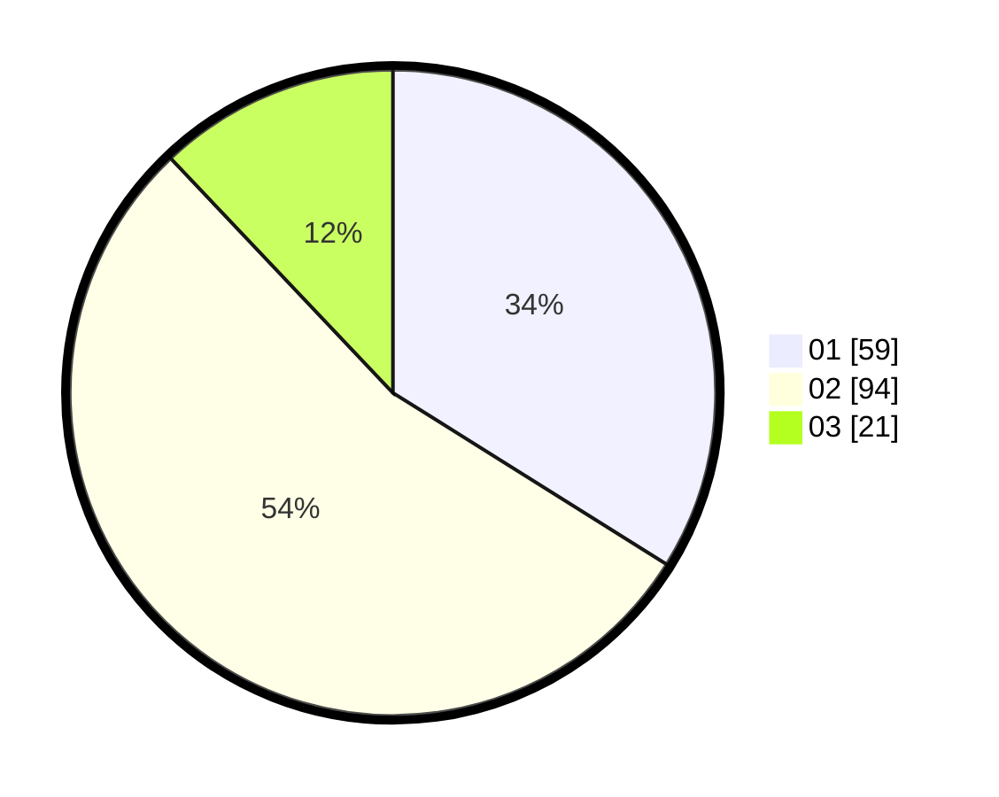

# Hasil

Hasil perolehan suara paslon dapat dilihat pada file paslon-01.txt, paslon-02.txt, dan paslon-03.txt.

Jika tidak ada, artinya data tersebut belum ada pada SIREKAP.

## Perolehan Suara

 * Paslon 01: **59**.
 * Paslon 02: **94**.
 * Paslon 03: **21**.

## Foto C Plano

https://sirekap-obj-formc.kpu.go.id/151a/pemilu/ppwp/31/73/08/10/01/3173081001116-20240214-224001--f001e74a-c432-4d38-b5f7-9d654fe0978f.jpg

https://sirekap-obj-formc.kpu.go.id/151a/pemilu/ppwp/31/73/08/10/01/3173081001116-20240216-064709--e5f830a6-1ddf-4bd6-8273-e0b2b3f86c24.jpg

https://sirekap-obj-formc.kpu.go.id/151a/pemilu/ppwp/31/73/08/10/01/3173081001116-20240214-224139--9ebd373d-496e-4d39-92ac-676155598428.jpg

## DATA PEMILIH TETAP

Jumlah pemilih dalam DPT: **217**.
 * L: **107**.
 * P: **110**.

## DATA PENGGUNA HAK PILIH

Jumlah pengguna hak pilih dalam DPT: **170**.
 * L: **80**.
 * P: **90**.

Jumlah pengguna hak pilih dalam DPTb: **4**.
 * L: **2**.
 * P: **2**.

Jumlah pengguna hak pilih dalam DPK: **3**.
 * L: **1**.
 * P: **2**.

Jumlah pengguna hak pilih: **177**.
 * L: **83**.
 * P: **94**.

## JUMLAH SUARA SAH DAN TIDAK SAH

JUMLAH SELURUH SUARA SAH: **174**.

JUMLAH SUARA TIDAK SAH: **3**.

JUMLAH SELURUH SUARA SAH DAN SUARA TIDAK SAH: **177**.
