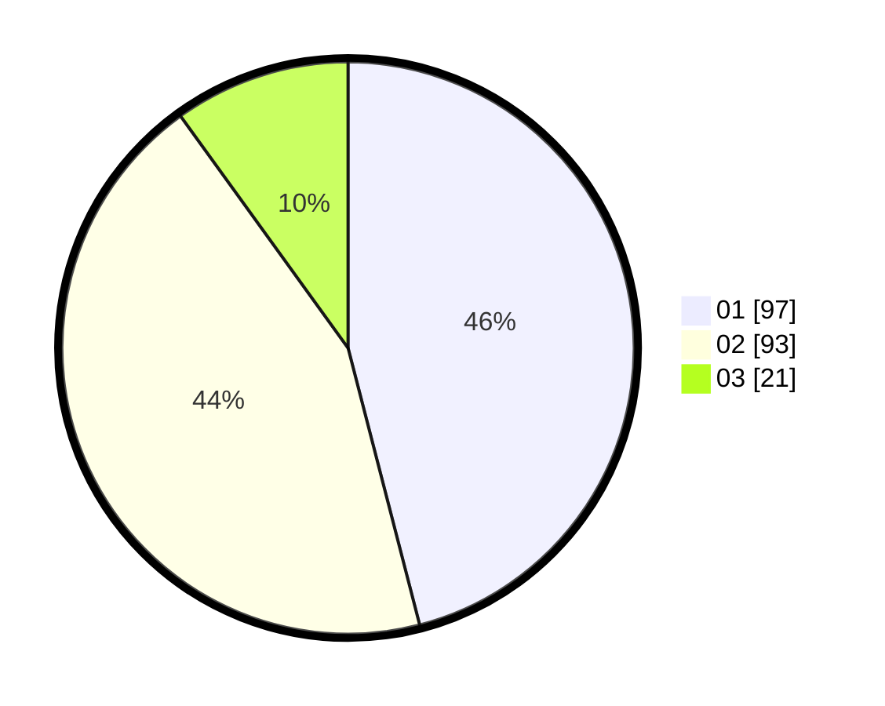

# Hasil

Hasil perolehan suara paslon dapat dilihat pada file paslon-01.txt, paslon-02.txt, dan paslon-03.txt.

Jika tidak ada, artinya data tersebut belum ada pada SIREKAP.

## Perolehan Suara

 * Paslon 01: **97**.
 * Paslon 02: **93**.
 * Paslon 03: **21**.

## Foto C Plano

https://sirekap-obj-formc.kpu.go.id/4dad/pemilu/ppwp/31/73/08/10/01/3173081001133-20240215-021621--6a61f47e-ef06-48ee-a3e7-fb8b6be116eb.jpg

https://sirekap-obj-formc.kpu.go.id/4dad/pemilu/ppwp/31/73/08/10/01/3173081001133-20240215-020927--d8648658-4e40-4338-803d-5468ac81637d.jpg
