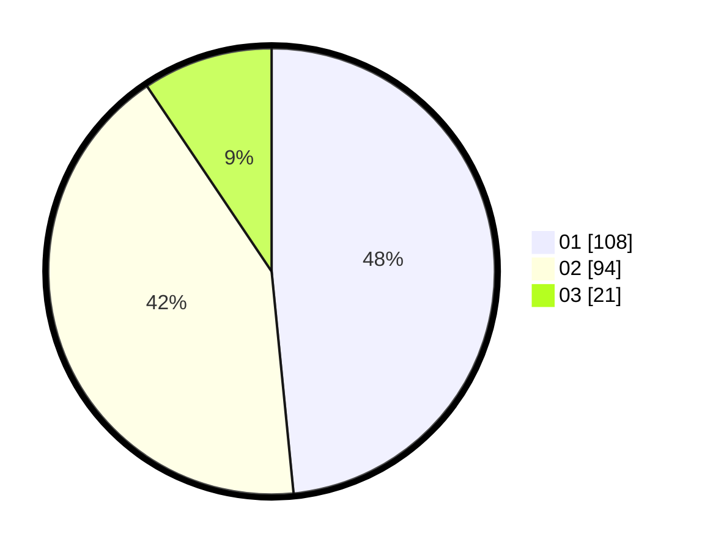

# Hasil

Hasil perolehan suara paslon dapat dilihat pada file paslon-01.txt, paslon-02.txt, dan paslon-03.txt.

Jika tidak ada, artinya data tersebut belum ada pada SIREKAP.

## Perolehan Suara

 * Paslon 01: **108**.
 * Paslon 02: **94**.
 * Paslon 03: **21**.

## Foto C Plano

https://sirekap-obj-formc.kpu.go.id/498e/pemilu/ppwp/31/73/08/10/01/3173081001134-20240214-224639--3e738bd4-f65d-4e15-9b1d-7c954288b17f.jpg

https://sirekap-obj-formc.kpu.go.id/498e/pemilu/ppwp/31/73/08/10/01/3173081001134-20240214-224810--775d6182-7e91-4400-9c36-973599a3f34a.jpg

https://sirekap-obj-formc.kpu.go.id/498e/pemilu/ppwp/31/73/08/10/01/3173081001134-20240214-224908--e2cf3d01-e50d-46ec-89c2-109312e753e0.jpg
