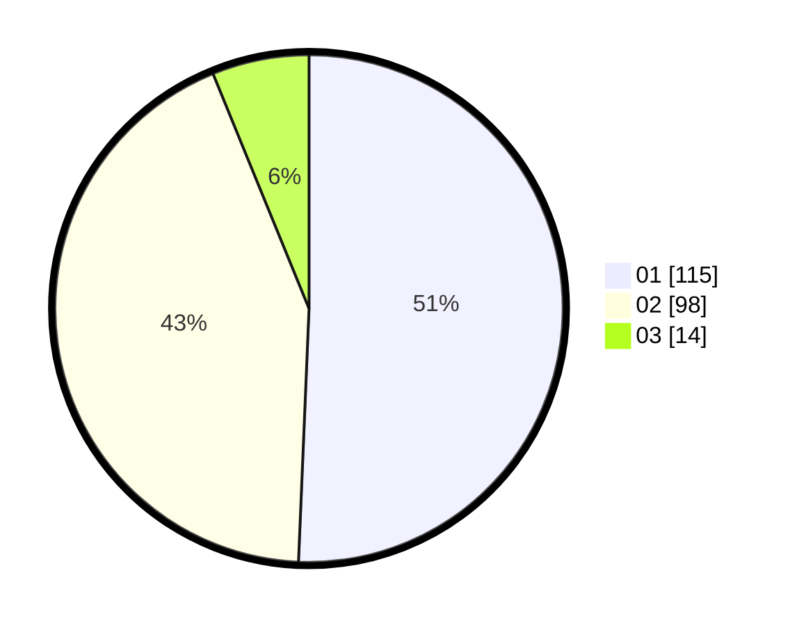

# Hasil

Hasil perolehan suara paslon dapat dilihat pada file paslon-01.txt, paslon-02.txt, dan paslon-03.txt.

Jika tidak ada, artinya data tersebut belum ada pada SIREKAP.

## Perolehan Suara

 * Paslon 01: **115**.
 * Paslon 02: **98**.
 * Paslon 03: **14**.

## Foto C Plano

https://sirekap-obj-formc.kpu.go.id/6324/pemilu/ppwp/31/73/08/10/01/3173081001135-20240216-142316--d490cf5d-45cf-45e0-b753-2550f0c7475f.jpg

https://sirekap-obj-formc.kpu.go.id/6324/pemilu/ppwp/31/73/08/10/01/3173081001135-20240216-142317--71705f38-69f1-4353-a2b6-cf4158bbb597.jpg

https://sirekap-obj-formc.kpu.go.id/6324/pemilu/ppwp/31/73/08/10/01/3173081001135-20240216-142317--77650edf-6077-4189-adfb-4f1b0a871f7d.jpg

## DATA PEMILIH TETAP

Jumlah pemilih dalam DPT: **283**.
 * L: **141**.
 * P: **142**.

## DATA PENGGUNA HAK PILIH

Jumlah pengguna hak pilih dalam DPT: **218**.
 * L: **108**.
 * P: **110**.

Jumlah pengguna hak pilih dalam DPTb: **1**.
 * L: **1**.
 * P: **0**.

Jumlah pengguna hak pilih dalam DPK: **8**.
 * L: **2**.
 * P: **6**.

Jumlah pengguna hak pilih: **227**.
 * L: **111**.
 * P: **116**.

## JUMLAH SUARA SAH DAN TIDAK SAH

JUMLAH SELURUH SUARA SAH: **227**.

JUMLAH SUARA TIDAK SAH: **0**.

JUMLAH SELURUH SUARA SAH DAN SUARA TIDAK SAH: **227**.
