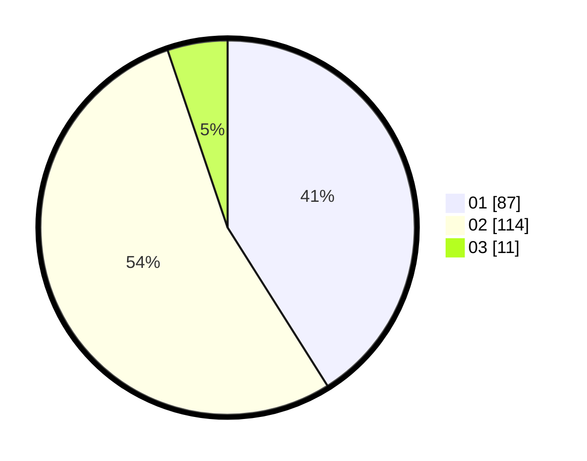

# Hasil

Hasil perolehan suara paslon dapat dilihat pada file paslon-01.txt, paslon-02.txt, dan paslon-03.txt.

Jika tidak ada, artinya data tersebut belum ada pada SIREKAP.

## Perolehan Suara

 * Paslon 01: **87**.
 * Paslon 02: **114**.
 * Paslon 03: **11**.

## Foto C Plano

https://sirekap-obj-formc.kpu.go.id/4ef2/pemilu/ppwp/31/73/08/10/01/3173081001137-20240216-175737--d11d216c-73e5-4516-852a-d8d2dcdeabdd.jpg

https://sirekap-obj-formc.kpu.go.id/4ef2/pemilu/ppwp/31/73/08/10/01/3173081001137-20240216-175738--611e2ca4-82c7-4651-b696-1cb177422d61.jpg

https://sirekap-obj-formc.kpu.go.id/4ef2/pemilu/ppwp/31/73/08/10/01/3173081001137-20240216-175737--9bcf3d4f-c08b-4a47-99c7-38a7663d21db.jpg

## DATA PEMILIH TETAP

Jumlah pemilih dalam DPT: **231**.
 * L: **118**.
 * P: **113**.

## DATA PENGGUNA HAK PILIH

Jumlah pengguna hak pilih dalam DPT: **209**.
 * L: **105**.
 * P: **104**.

Jumlah pengguna hak pilih dalam DPTb: **2**.
 * L: **0**.
 * P: **2**.

Jumlah pengguna hak pilih dalam DPK: **3**.
 * L: **0**.
 * P: **3**.

Jumlah pengguna hak pilih: **214**.
 * L: **105**.
 * P: **109**.

## JUMLAH SUARA SAH DAN TIDAK SAH

JUMLAH SELURUH SUARA SAH: **212**.

JUMLAH SUARA TIDAK SAH: **2**.

JUMLAH SELURUH SUARA SAH DAN SUARA TIDAK SAH: **214**.
