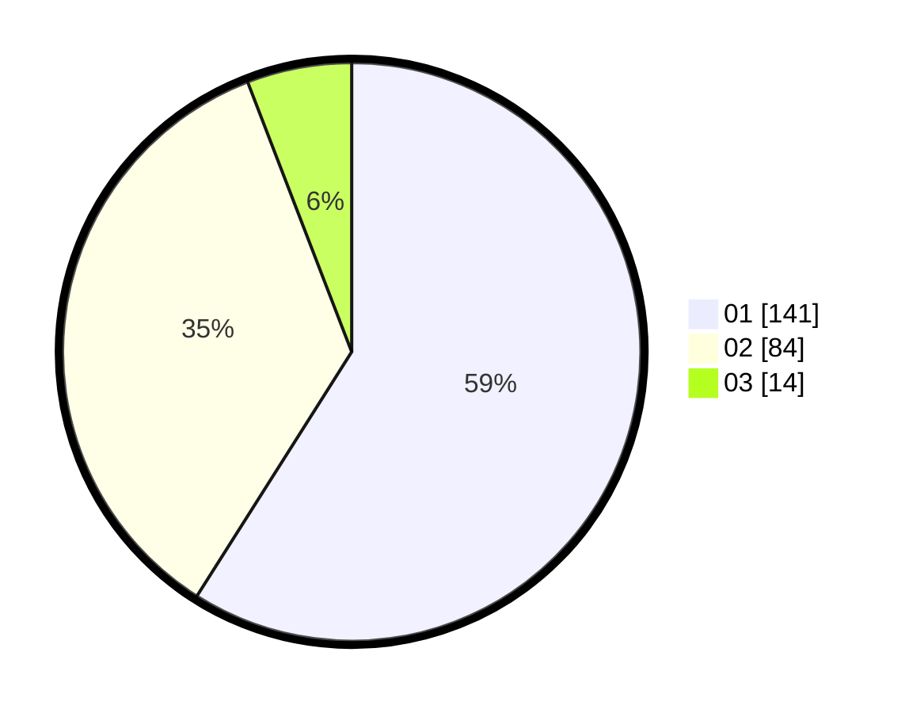

# Hasil

Hasil perolehan suara paslon dapat dilihat pada file paslon-01.txt, paslon-02.txt, dan paslon-03.txt.

Jika tidak ada, artinya data tersebut belum ada pada SIREKAP.

## Perolehan Suara

 * Paslon 01: **141**.
 * Paslon 02: **84**.
 * Paslon 03: **14**.

## Foto C Plano

https://sirekap-obj-formc.kpu.go.id/9a15/pemilu/ppwp/31/73/08/10/01/3173081001139-20240215-021342--26a89b16-de6c-4c63-8a82-a2bfc1664c60.jpg

https://sirekap-obj-formc.kpu.go.id/9a15/pemilu/ppwp/31/73/08/10/01/3173081001139-20240214-233611--daf24c71-ade7-4de4-a147-d51e8e9bae2e.jpg

https://sirekap-obj-formc.kpu.go.id/9a15/pemilu/ppwp/31/73/08/10/01/3173081001139-20240215-021543--7bbe5077-a269-4ba5-a90b-840609c31271.jpg
