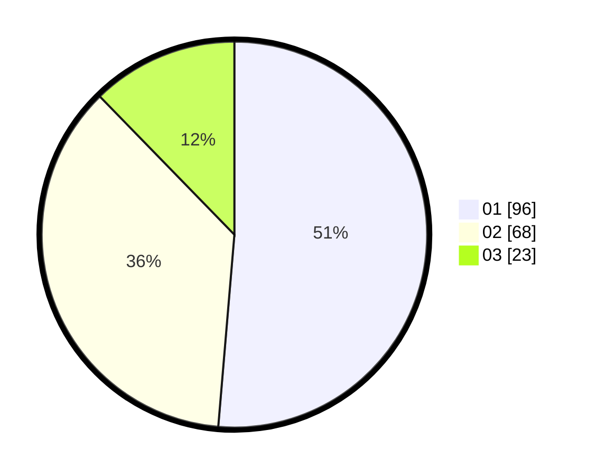

# Hasil

Hasil perolehan suara paslon dapat dilihat pada file paslon-01.txt, paslon-02.txt, dan paslon-03.txt.

Jika tidak ada, artinya data tersebut belum ada pada SIREKAP.

## Perolehan Suara

 * Paslon 01: **96**.
 * Paslon 02: **68**.
 * Paslon 03: **23**.

## Foto C Plano

https://sirekap-obj-formc.kpu.go.id/d049/pemilu/ppwp/31/73/08/10/01/3173081001144-20240214-190049--44d6f9dd-804b-4f53-80a1-fa3bcd4ee9a9.jpg

https://sirekap-obj-formc.kpu.go.id/d049/pemilu/ppwp/31/73/08/10/01/3173081001144-20240214-190319--93eddf43-9888-48b3-a3f2-56e6a6d6761b.jpg

https://sirekap-obj-formc.kpu.go.id/d049/pemilu/ppwp/31/73/08/10/01/3173081001144-20240214-190500--f39f110c-d77d-4755-9086-1f5039dc2237.jpg

## DATA PEMILIH TETAP

Jumlah pemilih dalam DPT: **216**.
 * L: **105**.
 * P: **111**.

## DATA PENGGUNA HAK PILIH

Jumlah pengguna hak pilih dalam DPT: **189**.
 * L: **89**.
 * P: **100**.

Jumlah pengguna hak pilih dalam DPTb: **3**.
 * L: **1**.
 * P: **2**.

Jumlah pengguna hak pilih dalam DPK: **1**.
 * L: **1**.
 * P: **0**.

Jumlah pengguna hak pilih: **193**.
 * L: **91**.
 * P: **102**.

## JUMLAH SUARA SAH DAN TIDAK SAH

JUMLAH SELURUH SUARA SAH: **187**.

JUMLAH SUARA TIDAK SAH: **6**.

JUMLAH SELURUH SUARA SAH DAN SUARA TIDAK SAH: **193**.
