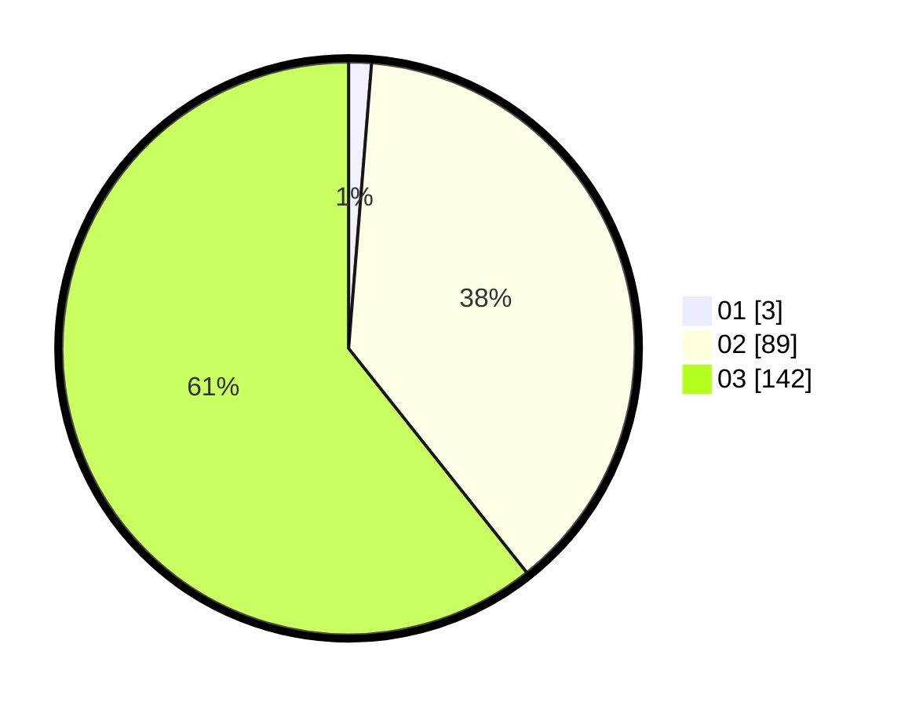

# Hasil

Hasil perolehan suara paslon dapat dilihat pada file paslon-01.txt, paslon-02.txt, dan paslon-03.txt.

Jika tidak ada, artinya data tersebut belum ada pada SIREKAP.

## Perolehan Suara

 * Paslon 01: **3**.
 * Paslon 02: **89**.
 * Paslon 03: **142**.

## Foto C Plano

https://sirekap-obj-formc.kpu.go.id/6f48/pemilu/ppwp/31/73/08/10/01/3173081001152-20240215-123852--4be1d321-4f2d-44f8-8a06-203e6b6cc23b.jpg

https://sirekap-obj-formc.kpu.go.id/6f48/pemilu/ppwp/31/73/08/10/01/3173081001152-20240215-123859--70442efe-1781-4064-bfe8-1b36f27f56c2.jpg
