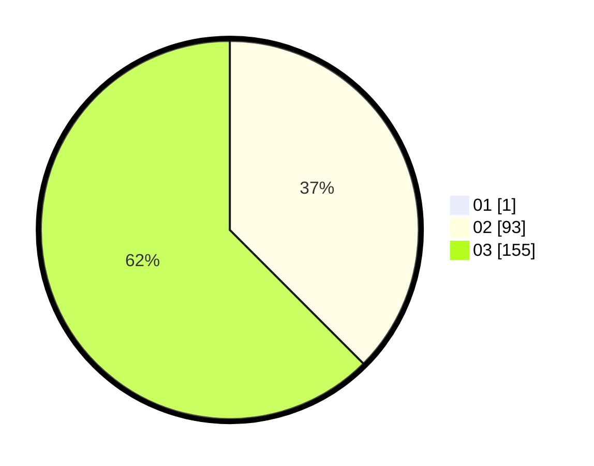

# Hasil

Hasil perolehan suara paslon dapat dilihat pada file paslon-01.txt, paslon-02.txt, dan paslon-03.txt.

Jika tidak ada, artinya data tersebut belum ada pada SIREKAP.

## Perolehan Suara

 * Paslon 01: **1**.
 * Paslon 02: **93**.
 * Paslon 03: **155**.

## Foto C Plano

https://sirekap-obj-formc.kpu.go.id/5560/pemilu/ppwp/31/73/08/10/01/3173081001153-20240216-014017--0abd746c-4811-44db-af92-79a3daf4f5c9.jpg

https://sirekap-obj-formc.kpu.go.id/5560/pemilu/ppwp/31/73/08/10/01/3173081001153-20240216-020046--fa983782-5024-4510-8346-df0df0e82953.jpg

https://sirekap-obj-formc.kpu.go.id/5560/pemilu/ppwp/31/73/08/10/01/3173081001153-20240216-015050--f6b1de52-0f90-4581-b50e-0b6c71873244.jpg

## DATA PEMILIH TETAP

Jumlah pemilih dalam DPT: **297**.
 * L: **133**.
 * P: **164**.

## DATA PENGGUNA HAK PILIH

Jumlah pengguna hak pilih dalam DPT: **234**.
 * L: **108**.
 * P: **126**.

Jumlah pengguna hak pilih dalam DPTb: **12**.
 * L: **3**.
 * P: **9**.

Jumlah pengguna hak pilih dalam DPK: **6**.
 * L: **6**.
 * P: **0**.

Jumlah pengguna hak pilih: **252**.
 * L: **117**.
 * P: **135**.

## JUMLAH SUARA SAH DAN TIDAK SAH

JUMLAH SELURUH SUARA SAH: **249**.

JUMLAH SUARA TIDAK SAH: **3**.

JUMLAH SELURUH SUARA SAH DAN SUARA TIDAK SAH: **252**.
