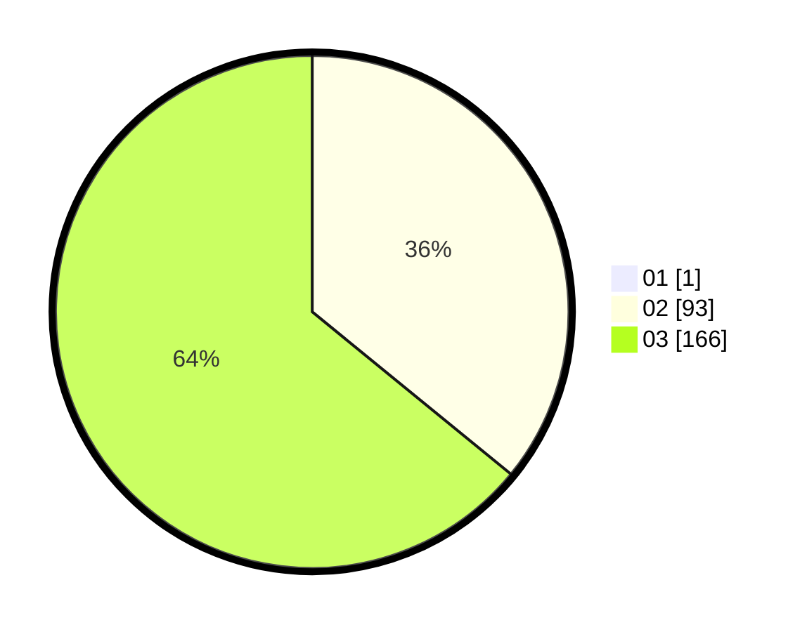

# Hasil

Hasil perolehan suara paslon dapat dilihat pada file paslon-01.txt, paslon-02.txt, dan paslon-03.txt.

Jika tidak ada, artinya data tersebut belum ada pada SIREKAP.

## Perolehan Suara

 * Paslon 01: **1**.
 * Paslon 02: **93**.
 * Paslon 03: **166**.

## Foto C Plano

https://sirekap-obj-formc.kpu.go.id/77b5/pemilu/ppwp/31/73/08/10/01/3173081001155-20240214-141216--bc253676-6fee-4b6c-afa9-946a22fc6b4c.jpg

https://sirekap-obj-formc.kpu.go.id/77b5/pemilu/ppwp/31/73/08/10/01/3173081001155-20240214-141254--f5c0b992-18c1-484e-9ebb-1d5e2caa337e.jpg

https://sirekap-obj-formc.kpu.go.id/77b5/pemilu/ppwp/31/73/08/10/01/3173081001155-20240214-201503--dbeafb06-8cdf-449c-8b06-ddae40a5314e.jpg

## DATA PEMILIH TETAP

Jumlah pemilih dalam DPT: **295**.
 * L: **142**.
 * P: **153**.

## DATA PENGGUNA HAK PILIH

Jumlah pengguna hak pilih dalam DPT: **243**.
 * L: **121**.
 * P: **122**.

Jumlah pengguna hak pilih dalam DPTb: **15**.
 * L: **5**.
 * P: **10**.

Jumlah pengguna hak pilih dalam DPK: **6**.
 * L: **3**.
 * P: **3**.

Jumlah pengguna hak pilih: **264**.
 * L: **129**.
 * P: **135**.

## JUMLAH SUARA SAH DAN TIDAK SAH

JUMLAH SELURUH SUARA SAH: **260**.

JUMLAH SUARA TIDAK SAH: **4**.

JUMLAH SELURUH SUARA SAH DAN SUARA TIDAK SAH: **264**.
