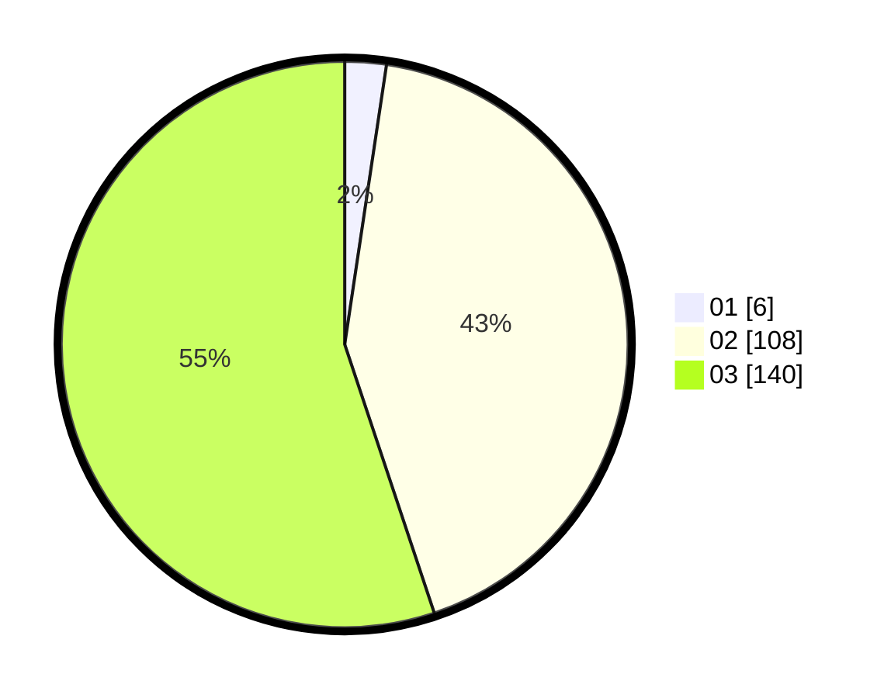

# Hasil

Hasil perolehan suara paslon dapat dilihat pada file paslon-01.txt, paslon-02.txt, dan paslon-03.txt.

Jika tidak ada, artinya data tersebut belum ada pada SIREKAP.

## Perolehan Suara

 * Paslon 01: **6**.
 * Paslon 02: **108**.
 * Paslon 03: **140**.

## Foto C Plano

https://sirekap-obj-formc.kpu.go.id/5fc6/pemilu/ppwp/31/73/08/10/01/3173081001156-20240214-201825--9b3f4074-9711-435f-9599-2a16e35ecec9.jpg

https://sirekap-obj-formc.kpu.go.id/5fc6/pemilu/ppwp/31/73/08/10/01/3173081001156-20240214-202024--19ed2115-b99b-4d1c-bdb4-973461fdbcda.jpg

https://sirekap-obj-formc.kpu.go.id/5fc6/pemilu/ppwp/31/73/08/10/01/3173081001156-20240214-201933--e9c23b31-7a3a-47c9-b9cb-344e92f7b48e.jpg
