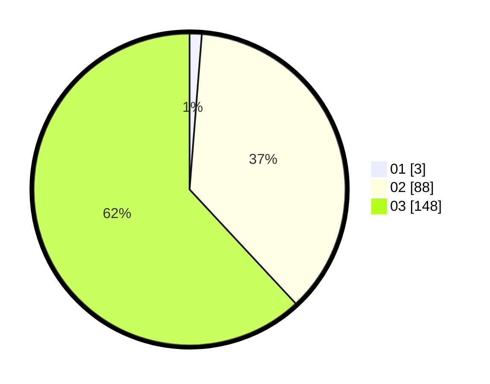

# Hasil

Hasil perolehan suara paslon dapat dilihat pada file paslon-01.txt, paslon-02.txt, dan paslon-03.txt.

Jika tidak ada, artinya data tersebut belum ada pada SIREKAP.

## Perolehan Suara

 * Paslon 01: **3**.
 * Paslon 02: **88**.
 * Paslon 03: **148**.

## Foto C Plano

https://sirekap-obj-formc.kpu.go.id/0e28/pemilu/ppwp/31/73/08/10/01/3173081001157-20240214-213710--8da25c73-39d6-4062-a448-2a607b3af7e1.jpg

https://sirekap-obj-formc.kpu.go.id/0e28/pemilu/ppwp/31/73/08/10/01/3173081001157-20240214-155358--422722fa-e1a9-4e7a-86ab-db2e89eac6de.jpg

https://sirekap-obj-formc.kpu.go.id/0e28/pemilu/ppwp/31/73/08/10/01/3173081001157-20240214-155403--46bab9a6-58e4-413e-b954-7a65dae9fa7f.jpg

## DATA PEMILIH TETAP

Jumlah pemilih dalam DPT: **295**.
 * L: **140**.
 * P: **155**.

## DATA PENGGUNA HAK PILIH

Jumlah pengguna hak pilih dalam DPT: **219**.
 * L: **102**.
 * P: **117**.

Jumlah pengguna hak pilih dalam DPTb: **9**.
 * L: **4**.
 * P: **5**.

Jumlah pengguna hak pilih dalam DPK: **11**.
 * L: **3**.
 * P: **8**.

Jumlah pengguna hak pilih: **239**.
 * L: **109**.
 * P: **130**.

## JUMLAH SUARA SAH DAN TIDAK SAH

JUMLAH SELURUH SUARA SAH: **239**.

JUMLAH SUARA TIDAK SAH: **0**.

JUMLAH SELURUH SUARA SAH DAN SUARA TIDAK SAH: **239**.
