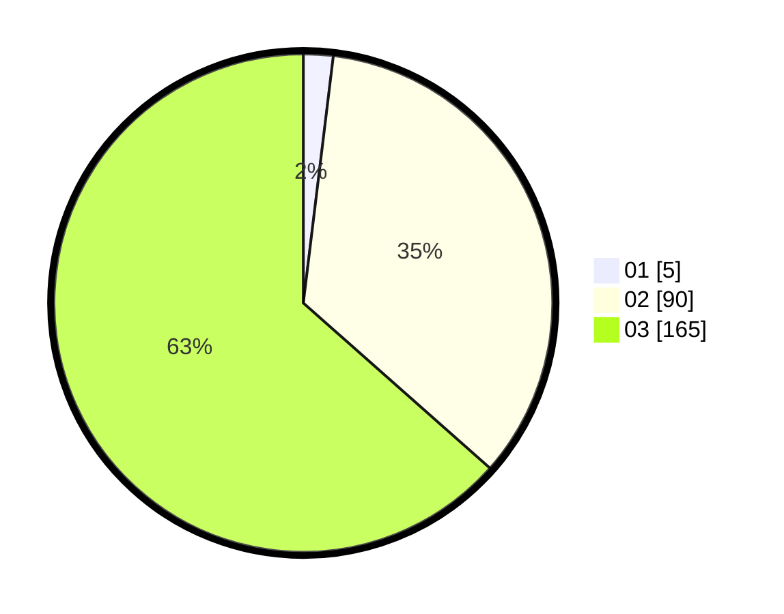

# Hasil

Hasil perolehan suara paslon dapat dilihat pada file paslon-01.txt, paslon-02.txt, dan paslon-03.txt.

Jika tidak ada, artinya data tersebut belum ada pada SIREKAP.

## Perolehan Suara

 * Paslon 01: **5**.
 * Paslon 02: **90**.
 * Paslon 03: **165**.

## Foto C Plano

https://sirekap-obj-formc.kpu.go.id/89f0/pemilu/ppwp/31/73/08/10/01/3173081001158-20240214-185437--b42176a2-e70d-475d-8da1-0e79162178d3.jpg

https://sirekap-obj-formc.kpu.go.id/89f0/pemilu/ppwp/31/73/08/10/01/3173081001158-20240214-185556--8e707280-2a0a-4e22-9557-ec4724acedad.jpg
