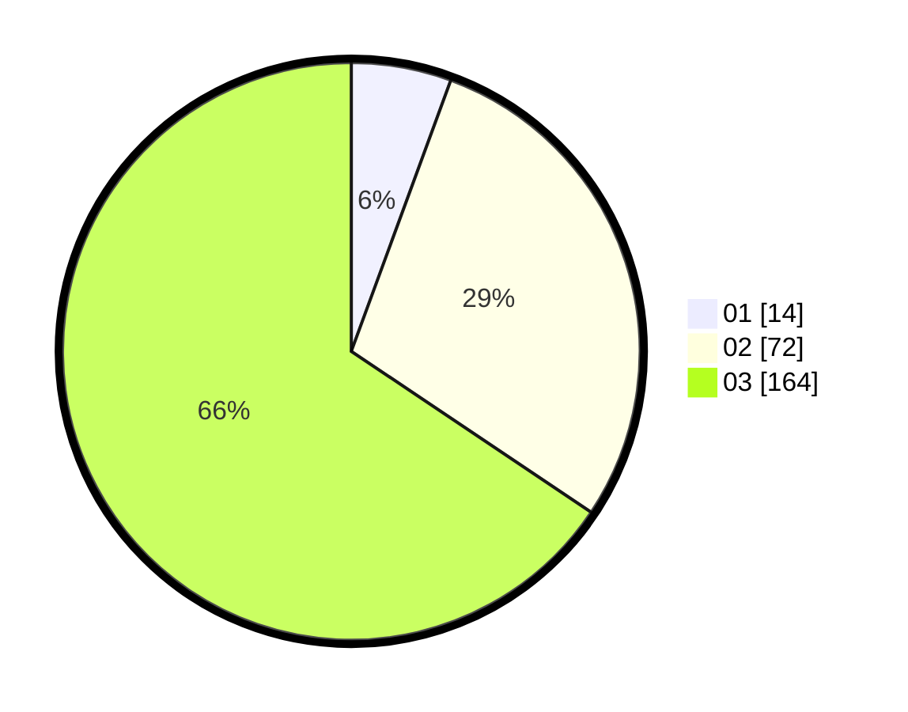

# Hasil

Hasil perolehan suara paslon dapat dilihat pada file paslon-01.txt, paslon-02.txt, dan paslon-03.txt.

Jika tidak ada, artinya data tersebut belum ada pada SIREKAP.

## Perolehan Suara

 * Paslon 01: **14**.
 * Paslon 02: **72**.
 * Paslon 03: **164**.

## Foto C Plano

https://sirekap-obj-formc.kpu.go.id/3eb9/pemilu/ppwp/31/73/08/10/01/3173081001160-20240214-203530--a68afacf-a35f-471b-9116-8ce62555a19d.jpg

https://sirekap-obj-formc.kpu.go.id/3eb9/pemilu/ppwp/31/73/08/10/01/3173081001160-20240214-203644--24b6c544-c8bf-45a9-a631-7ce00dee6813.jpg

https://sirekap-obj-formc.kpu.go.id/3eb9/pemilu/ppwp/31/73/08/10/01/3173081001160-20240215-220527--9fcef362-4342-4a46-97ae-d465fdfece01.jpg

## DATA PEMILIH TETAP

Jumlah pemilih dalam DPT: **295**.
 * L: **140**.
 * P: **155**.

## DATA PENGGUNA HAK PILIH

Jumlah pengguna hak pilih dalam DPT: **232**.
 * L: **107**.
 * P: **125**.

Jumlah pengguna hak pilih dalam DPTb: **12**.
 * L: **5**.
 * P: **5**.

Jumlah pengguna hak pilih dalam DPK: **7**.
 * L: **4**.
 * P: **3**.

Jumlah pengguna hak pilih: **251**.
 * L: **112**.
 * P: **139**.

## JUMLAH SUARA SAH DAN TIDAK SAH

JUMLAH SELURUH SUARA SAH: **0**.

JUMLAH SUARA TIDAK SAH: **0**.

JUMLAH SELURUH SUARA SAH DAN SUARA TIDAK SAH: **0**.
