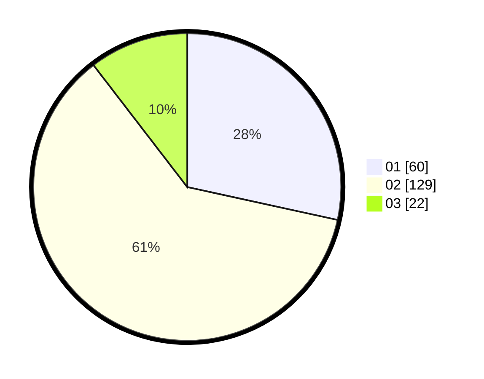

# Hasil

Hasil perolehan suara paslon dapat dilihat pada file paslon-01.txt, paslon-02.txt, dan paslon-03.txt.

Jika tidak ada, artinya data tersebut belum ada pada SIREKAP.

## Perolehan Suara

 * Paslon 01: **60**.
 * Paslon 02: **129**.
 * Paslon 03: **22**.

## Foto C Plano

https://sirekap-obj-formc.kpu.go.id/51fe/pemilu/ppwp/31/73/08/10/01/3173081001165-20240215-003016--da6fa844-ab05-4866-a75c-1d9845bb6ec5.jpg

https://sirekap-obj-formc.kpu.go.id/51fe/pemilu/ppwp/31/73/08/10/01/3173081001165-20240215-003100--872eae7f-e437-4129-b9b1-a5da768eafec.jpg

https://sirekap-obj-formc.kpu.go.id/51fe/pemilu/ppwp/31/73/08/10/01/3173081001165-20240215-003156--b534dca5-f8cd-4f99-972d-206e4beda53b.jpg
