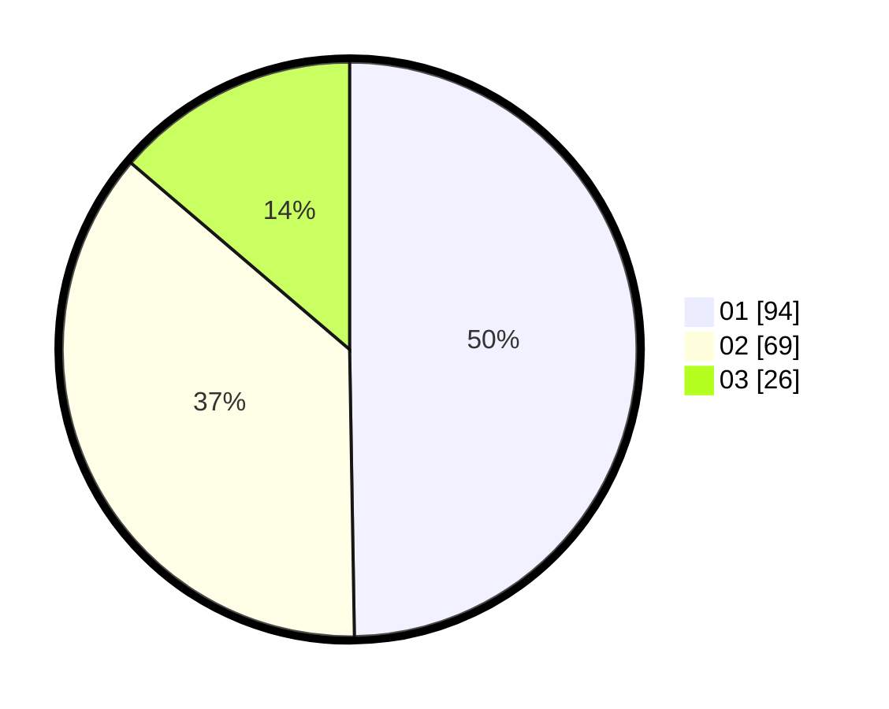

# Hasil

Hasil perolehan suara paslon dapat dilihat pada file paslon-01.txt, paslon-02.txt, dan paslon-03.txt.

Jika tidak ada, artinya data tersebut belum ada pada SIREKAP.

## Perolehan Suara

 * Paslon 01: **94**.
 * Paslon 02: **69**.
 * Paslon 03: **26**.

## Foto C Plano

https://sirekap-obj-formc.kpu.go.id/fea2/pemilu/ppwp/31/73/08/10/01/3173081001170-20240215-022206--52baad72-9f7b-4a1f-8106-36b97f8b2961.jpg

https://sirekap-obj-formc.kpu.go.id/fea2/pemilu/ppwp/31/73/08/10/01/3173081001170-20240215-023031--b96e3f7e-8ffb-4241-8d4b-ee37230d5402.jpg

https://sirekap-obj-formc.kpu.go.id/fea2/pemilu/ppwp/31/73/08/10/01/3173081001170-20240215-023637--47df49f5-c083-42b6-bb94-01c9361f7bc4.jpg

## DATA PEMILIH TETAP

Jumlah pemilih dalam DPT: **265**.
 * L: **130**.
 * P: **135**.

## DATA PENGGUNA HAK PILIH

Jumlah pengguna hak pilih dalam DPT: **179**.
 * L: **86**.
 * P: **93**.

Jumlah pengguna hak pilih dalam DPTb: **0**.
 * L: **0**.
 * P: **0**.

Jumlah pengguna hak pilih dalam DPK: **10**.
 * L: **7**.
 * P: **3**.

Jumlah pengguna hak pilih: **189**.
 * L: **93**.
 * P: **96**.

## JUMLAH SUARA SAH DAN TIDAK SAH

JUMLAH SELURUH SUARA SAH: **189**.

JUMLAH SUARA TIDAK SAH: **0**.

JUMLAH SELURUH SUARA SAH DAN SUARA TIDAK SAH: **189**.
