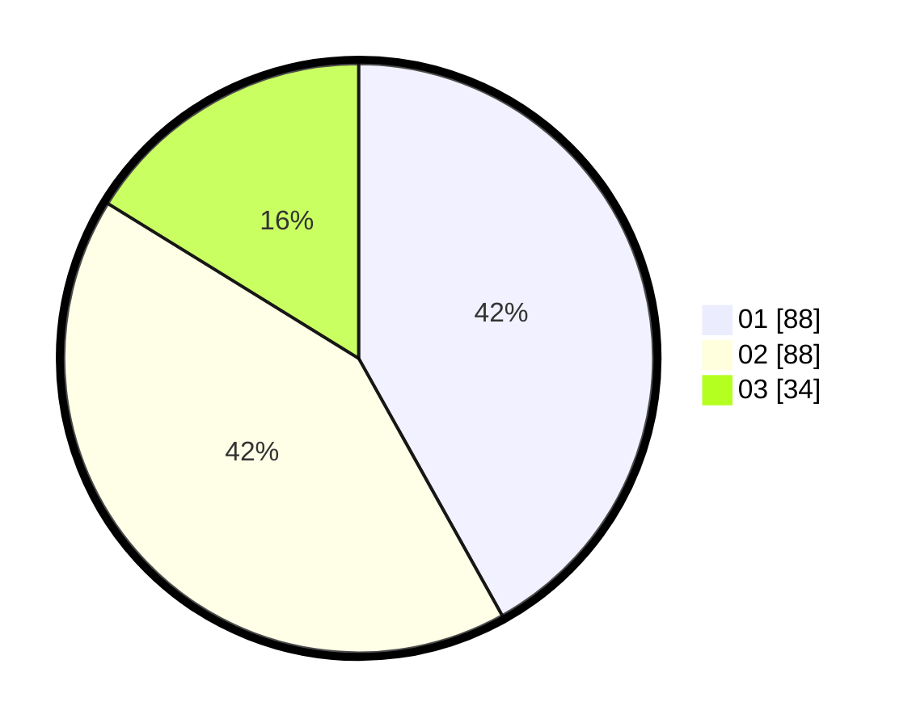

# Hasil

Hasil perolehan suara paslon dapat dilihat pada file paslon-01.txt, paslon-02.txt, dan paslon-03.txt.

Jika tidak ada, artinya data tersebut belum ada pada SIREKAP.

## Perolehan Suara

 * Paslon 01: **88**.
 * Paslon 02: **88**.
 * Paslon 03: **34**.

## Foto C Plano

https://sirekap-obj-formc.kpu.go.id/eefc/pemilu/ppwp/31/73/08/10/01/3173081001172-20240214-210433--c42b3828-691f-4015-bb51-d6029218a8c1.jpg

https://sirekap-obj-formc.kpu.go.id/eefc/pemilu/ppwp/31/73/08/10/01/3173081001172-20240214-210439--e981a67e-0173-49c6-a7ec-8f3afadf5597.jpg

https://sirekap-obj-formc.kpu.go.id/eefc/pemilu/ppwp/31/73/08/10/01/3173081001172-20240214-210446--fdfb6541-4857-41ab-83fa-ef069058552f.jpg
