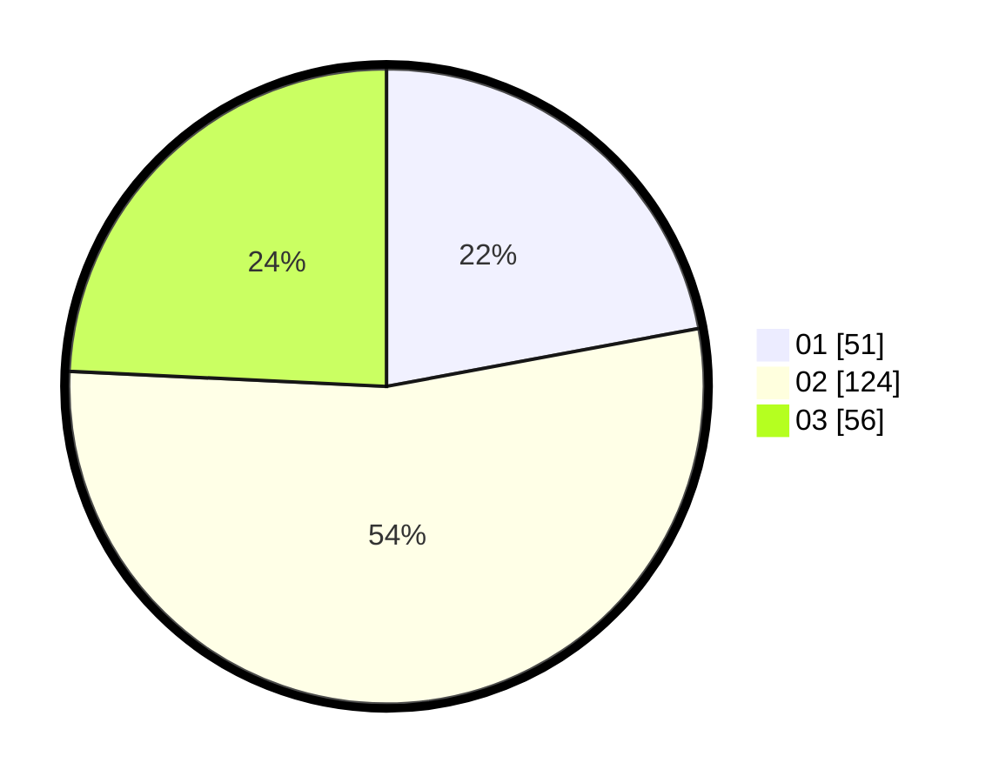

# Hasil

Hasil perolehan suara paslon dapat dilihat pada file paslon-01.txt, paslon-02.txt, dan paslon-03.txt.

Jika tidak ada, artinya data tersebut belum ada pada SIREKAP.

## Perolehan Suara

 * Paslon 01: **51**.
 * Paslon 02: **124**.
 * Paslon 03: **56**.

## Foto C Plano

https://sirekap-obj-formc.kpu.go.id/d076/pemilu/ppwp/31/73/08/10/01/3173081001173-20240216-003012--87a1778d-46ab-4605-82e3-b768874ad919.jpg

https://sirekap-obj-formc.kpu.go.id/d076/pemilu/ppwp/31/73/08/10/01/3173081001173-20240214-185059--67de0bb9-68ad-439f-8e02-86738fab2d0b.jpg

https://sirekap-obj-formc.kpu.go.id/d076/pemilu/ppwp/31/73/08/10/01/3173081001173-20240214-185112--05af926a-4738-4db7-bc06-d77535e1e446.jpg

## DATA PEMILIH TETAP

Jumlah pemilih dalam DPT: **279**.
 * L: **144**.
 * P: **135**.

## DATA PENGGUNA HAK PILIH

Jumlah pengguna hak pilih dalam DPT: **232**.
 * L: **117**.
 * P: **115**.

Jumlah pengguna hak pilih dalam DPTb: **2**.
 * L: **1**.
 * P: **1**.

Jumlah pengguna hak pilih dalam DPK: **0**.
 * L: **0**.
 * P: **0**.

Jumlah pengguna hak pilih: **234**.
 * L: **118**.
 * P: **116**.

## JUMLAH SUARA SAH DAN TIDAK SAH

JUMLAH SELURUH SUARA SAH: **231**.

JUMLAH SUARA TIDAK SAH: **3**.

JUMLAH SELURUH SUARA SAH DAN SUARA TIDAK SAH: **234**.
