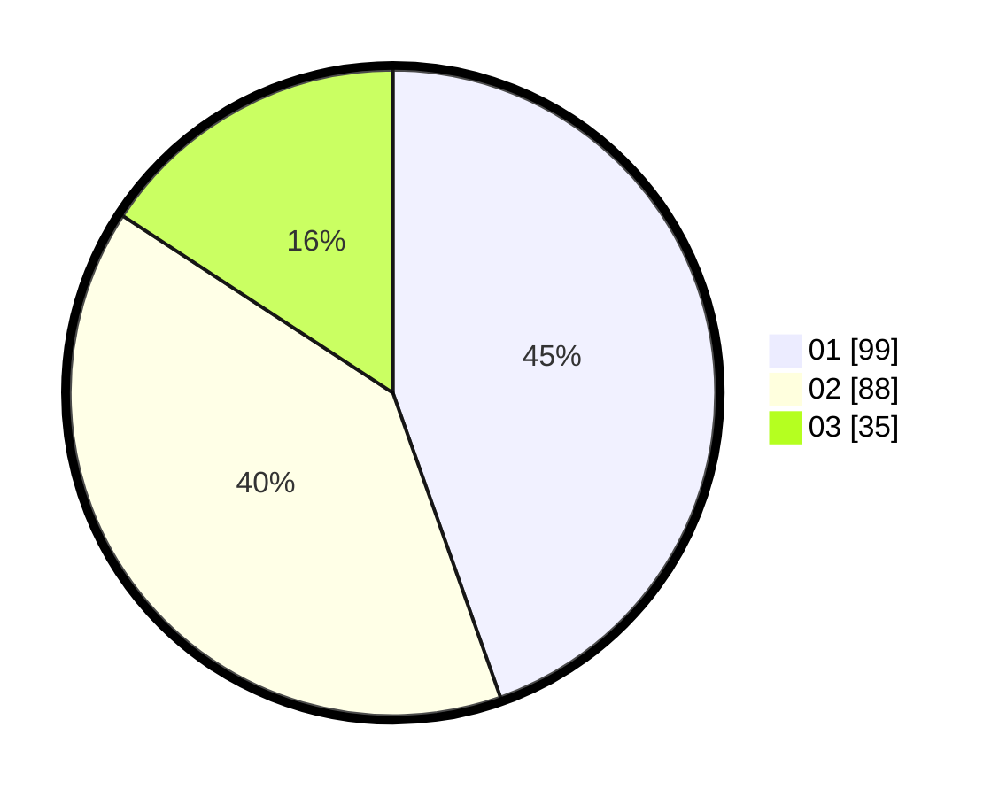

# Hasil

Hasil perolehan suara paslon dapat dilihat pada file paslon-01.txt, paslon-02.txt, dan paslon-03.txt.

Jika tidak ada, artinya data tersebut belum ada pada SIREKAP.

## Perolehan Suara

 * Paslon 01: **99**.
 * Paslon 02: **88**.
 * Paslon 03: **35**.

## Foto C Plano

https://sirekap-obj-formc.kpu.go.id/f59b/pemilu/ppwp/31/73/08/10/01/3173081001175-20240214-222310--67417f7e-751e-49a1-b565-e3a1dfdc0f17.jpg

https://sirekap-obj-formc.kpu.go.id/f59b/pemilu/ppwp/31/73/08/10/01/3173081001175-20240214-222512--57c0c178-6fc8-48cd-9ce7-538df4b26b37.jpg

https://sirekap-obj-formc.kpu.go.id/f59b/pemilu/ppwp/31/73/08/10/01/3173081001175-20240214-222649--d9eca586-d06f-4f46-b17d-d56d176f2746.jpg
