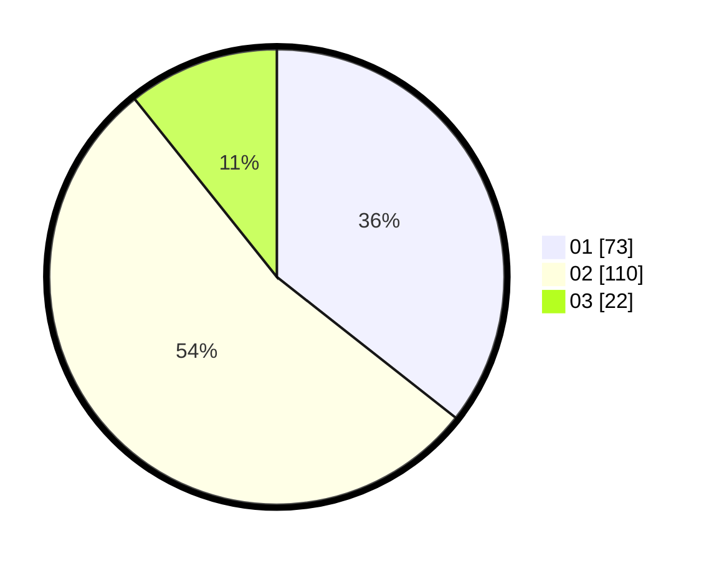

# Hasil

Hasil perolehan suara paslon dapat dilihat pada file paslon-01.txt, paslon-02.txt, dan paslon-03.txt.

Jika tidak ada, artinya data tersebut belum ada pada SIREKAP.

## Perolehan Suara

 * Paslon 01: **73**.
 * Paslon 02: **110**.
 * Paslon 03: **22**.

## Foto C Plano

https://sirekap-obj-formc.kpu.go.id/dfb2/pemilu/ppwp/31/73/08/10/01/3173081001179-20240214-224321--e7e39306-3a66-422e-95e2-e84f99d3bcc8.jpg

https://sirekap-obj-formc.kpu.go.id/dfb2/pemilu/ppwp/31/73/08/10/01/3173081001179-20240214-224528--859921f2-d557-46ea-83b4-865d67119381.jpg

https://sirekap-obj-formc.kpu.go.id/dfb2/pemilu/ppwp/31/73/08/10/01/3173081001179-20240214-224704--f6487cc1-aef4-423c-9c84-90220dfbfc2d.jpg
