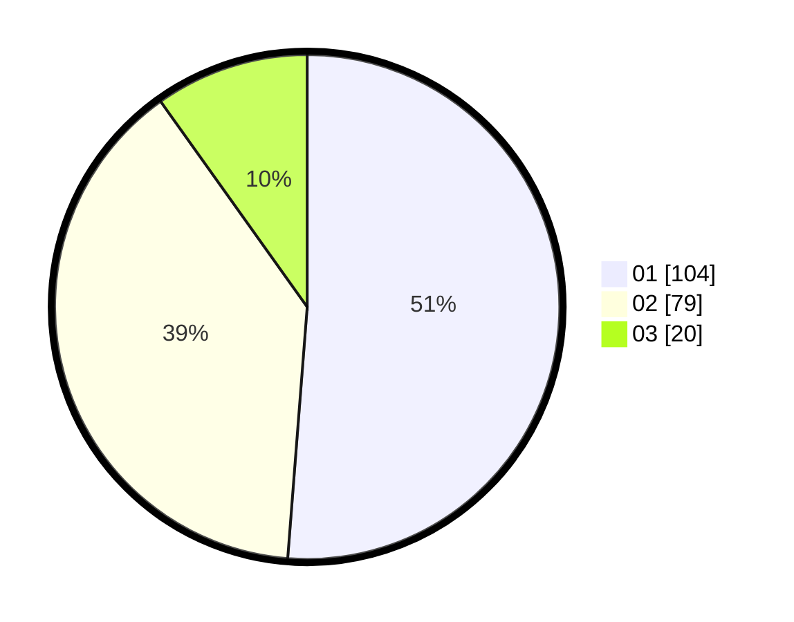

# Hasil

Hasil perolehan suara paslon dapat dilihat pada file paslon-01.txt, paslon-02.txt, dan paslon-03.txt.

Jika tidak ada, artinya data tersebut belum ada pada SIREKAP.

## Perolehan Suara

 * Paslon 01: **104**.
 * Paslon 02: **79**.
 * Paslon 03: **20**.

## Foto C Plano

https://sirekap-obj-formc.kpu.go.id/66bb/pemilu/ppwp/31/73/08/10/01/3173081001180-20240214-211415--53736ec0-6da7-41d7-9c39-8f66c79922c4.jpg

https://sirekap-obj-formc.kpu.go.id/66bb/pemilu/ppwp/31/73/08/10/01/3173081001180-20240214-211915--1683bd71-9151-496a-be4b-bc74fb02a571.jpg

https://sirekap-obj-formc.kpu.go.id/66bb/pemilu/ppwp/31/73/08/10/01/3173081001180-20240214-210922--d888c524-8790-4450-9f27-6727b0726472.jpg
