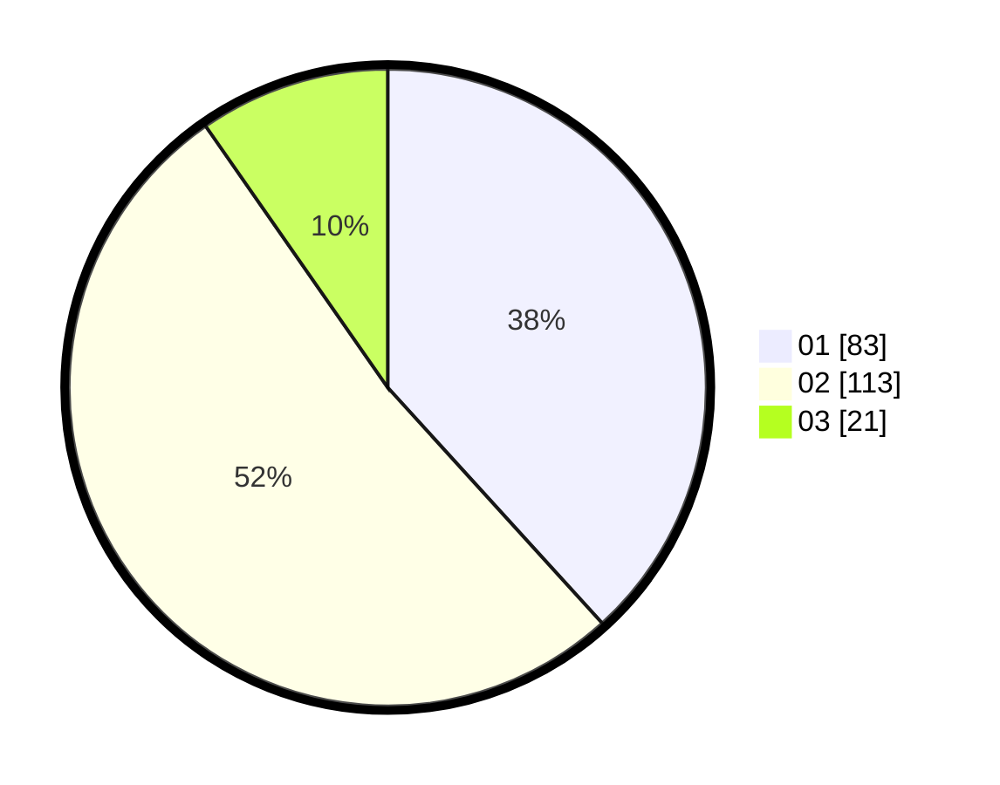

# Hasil

Hasil perolehan suara paslon dapat dilihat pada file paslon-01.txt, paslon-02.txt, dan paslon-03.txt.

Jika tidak ada, artinya data tersebut belum ada pada SIREKAP.

## Perolehan Suara

 * Paslon 01: **83**.
 * Paslon 02: **113**.
 * Paslon 03: **21**.

## Foto C Plano

https://sirekap-obj-formc.kpu.go.id/d1e4/pemilu/ppwp/31/73/08/10/01/3173081001181-20240214-214042--6c398a02-d950-4c7f-be7a-55b8efa0c0a9.jpg

https://sirekap-obj-formc.kpu.go.id/d1e4/pemilu/ppwp/31/73/08/10/01/3173081001181-20240214-214411--3d31957a-925e-4713-be03-c0dc0153abc5.jpg

https://sirekap-obj-formc.kpu.go.id/d1e4/pemilu/ppwp/31/73/08/10/01/3173081001181-20240214-214600--c0800191-6ac2-42d4-98ce-8e27ccfb0662.jpg
