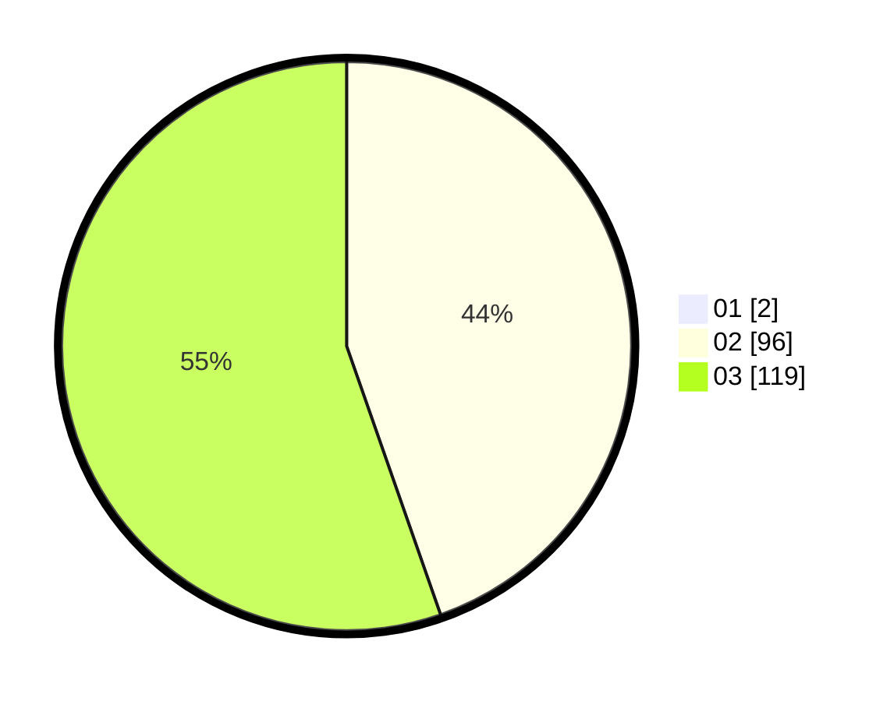

# Hasil

Hasil perolehan suara paslon dapat dilihat pada file paslon-01.txt, paslon-02.txt, dan paslon-03.txt.

Jika tidak ada, artinya data tersebut belum ada pada SIREKAP.

## Perolehan Suara

 * Paslon 01: **2**.
 * Paslon 02: **96**.
 * Paslon 03: **119**.

## Foto C Plano

https://sirekap-obj-formc.kpu.go.id/052e/pemilu/ppwp/31/73/08/10/01/3173081001185-20240214-214655--208a0a1e-c918-45d8-a1d2-25cb0adc36bc.jpg

https://sirekap-obj-formc.kpu.go.id/052e/pemilu/ppwp/31/73/08/10/01/3173081001185-20240214-214733--10fc5623-fddb-4dd0-9d6d-e6b6ad0022b3.jpg

https://sirekap-obj-formc.kpu.go.id/052e/pemilu/ppwp/31/73/08/10/01/3173081001185-20240214-214911--85f17613-d5ae-41f9-b66e-cfe113acd2e5.jpg
