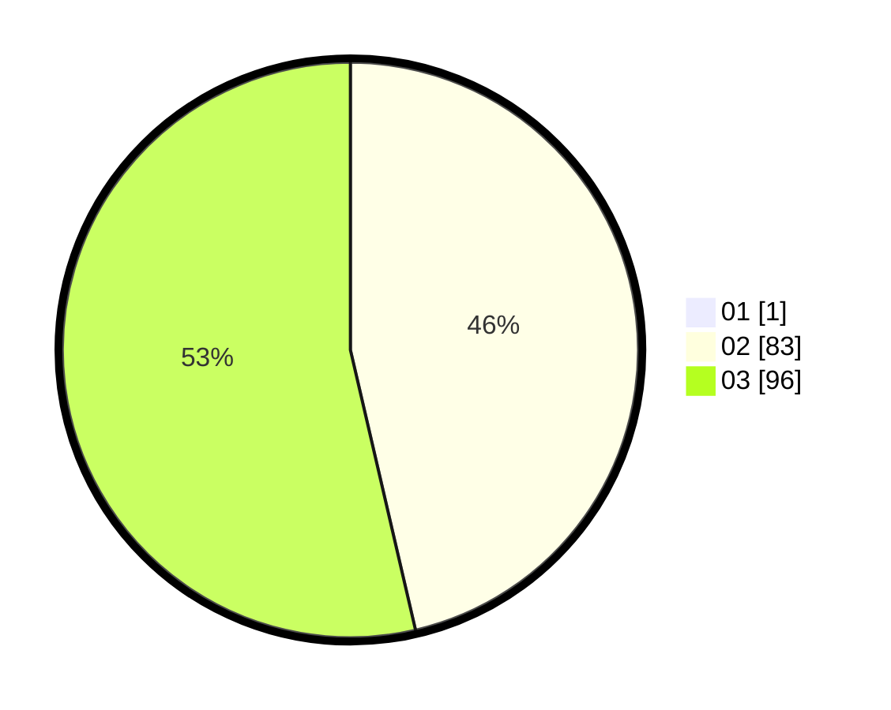

# Hasil

Hasil perolehan suara paslon dapat dilihat pada file paslon-01.txt, paslon-02.txt, dan paslon-03.txt.

Jika tidak ada, artinya data tersebut belum ada pada SIREKAP.

## Perolehan Suara

 * Paslon 01: **1**.
 * Paslon 02: **83**.
 * Paslon 03: **96**.

## Foto C Plano

https://sirekap-obj-formc.kpu.go.id/7ac7/pemilu/ppwp/31/73/08/10/01/3173081001186-20240214-194525--638ffcca-9cf2-40de-95f9-c137f2a50f30.jpg

https://sirekap-obj-formc.kpu.go.id/7ac7/pemilu/ppwp/31/73/08/10/01/3173081001186-20240214-204819--e365e775-d3e5-45d7-80c3-d40635922289.jpg

https://sirekap-obj-formc.kpu.go.id/7ac7/pemilu/ppwp/31/73/08/10/01/3173081001186-20240214-194626--3aceef9e-f7b6-4c77-86f7-ac68ebbd63df.jpg

## DATA PEMILIH TETAP

Jumlah pemilih dalam DPT: **199**.
 * L: **90**.
 * P: **109**.

## DATA PENGGUNA HAK PILIH

Jumlah pengguna hak pilih dalam DPT: **153**.
 * L: **72**.
 * P: **81**.

Jumlah pengguna hak pilih dalam DPTb: **15**.
 * L: **1**.
 * P: **14**.

Jumlah pengguna hak pilih dalam DPK: **14**.
 * L: **7**.
 * P: **7**.

Jumlah pengguna hak pilih: **182**.
 * L: **80**.
 * P: **102**.

## JUMLAH SUARA SAH DAN TIDAK SAH

JUMLAH SELURUH SUARA SAH: **180**.

JUMLAH SUARA TIDAK SAH: **2**.

JUMLAH SELURUH SUARA SAH DAN SUARA TIDAK SAH: **182**.
